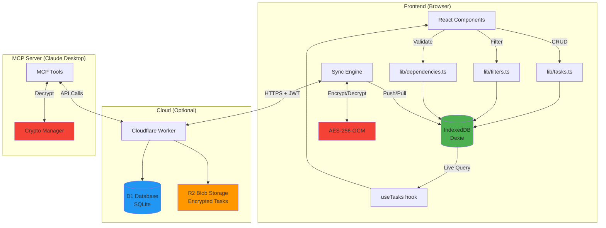
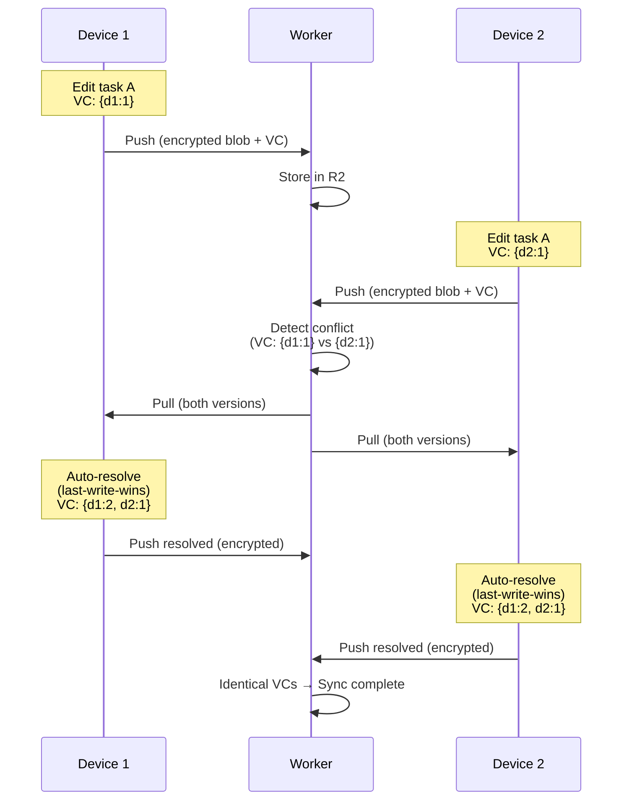

# GSD Task Manager - Database Architecture

## Overview

GSD Task Manager uses **IndexedDB** via **Dexie.js** for client-side data persistence. The database follows a **zero-knowledge architecture** with optional end-to-end encrypted cloud sync. All data is stored locally in the browser, with JSON export/import for backups.

**Current Schema Version:** 12

---

## Entity-Relationship Diagram

```mermaid
erDiagram
    tasks ||--o{ tasks : "depends on (dependencies)"
    tasks ||--o{ tasks : "spawns (parentTaskId)"
    tasks ||--o{ archivedTasks : "archives to"
    tasks ||--o{ syncQueue : "queued for sync"

    syncHistory }o--|| deviceInfo : "performed by"

    tasks {
        string id PK "UUID, indexed"
        string title "1-80 chars"
        string description "max 600 chars"
        boolean urgent "Eisenhower matrix axis"
        boolean important "Eisenhower matrix axis"
        string quadrant "Derived from urgent+important, indexed"
        boolean completed "indexed, compound with quadrant"
        string completedAt "ISO timestamp, indexed"
        string dueDate "ISO timestamp, optional, indexed"
        string createdAt "ISO timestamp, indexed"
        string updatedAt "ISO timestamp, indexed"
        string recurrence "none|daily|weekly|monthly, indexed"
        array tags "Multi-entry index, max 30 chars each"
        array subtasks "Embedded Subtask objects"
        array dependencies "Task IDs, multi-entry index"
        string parentTaskId "For recurring instances"
        number notifyBefore "Minutes before due"
        boolean notificationEnabled "Default true"
        boolean notificationSent "indexed"
        string lastNotificationAt "ISO timestamp"
        string snoozedUntil "ISO timestamp"
        object vectorClock "device_id to version_num"
        string archivedAt "ISO timestamp (when archived)"
        number estimatedMinutes "Planned time to complete"
        number timeSpent "Total minutes worked"
        array timeEntries "Array of TimeEntry objects"
    }

    archivedTasks {
        string id PK "UUID, indexed"
        string quadrant "indexed"
        boolean completed "indexed"
        string dueDate "ISO timestamp, indexed"
        string completedAt "ISO timestamp, indexed"
        string archivedAt "ISO timestamp, indexed"
        object __all_task_fields__ "Same schema as tasks table"
    }

    smartViews {
        string id PK "UUID, indexed"
        string name "indexed"
        string description "optional"
        string icon "optional emoji/icon"
        object criteria "FilterCriteria object"
        boolean isBuiltIn "indexed"
        string createdAt "ISO timestamp, indexed"
        string updatedAt "ISO timestamp"
    }

    notificationSettings {
        string id PK "Singleton: always 'settings'"
        boolean enabled "Default true"
        number defaultReminder "Minutes, default 15"
        boolean soundEnabled "Default true"
        string quietHoursStart "HH:mm format"
        string quietHoursEnd "HH:mm format"
        boolean permissionAsked "Default false"
        string updatedAt "ISO timestamp"
    }

    syncQueue {
        string id PK "UUID, indexed"
        string taskId "FK to tasks.id, indexed"
        string operation "create|update|delete"
        number timestamp "Unix timestamp, indexed"
        number retryCount "indexed"
        object payload "TaskRecord or null"
        object vectorClock "device_id to version_num"
        array consolidatedFrom "IDs of merged operations"
        number lastAttemptAt "Unix timestamp"
    }

    syncMetadata {
        string key PK "Singleton: always 'sync_config'"
        boolean enabled "Sync on/off"
        string userId "OAuth user ID, nullable"
        string deviceId "UUID"
        string deviceName "User-friendly name"
        string email "OAuth email, nullable"
        string token "JWT, nullable"
        number tokenExpiresAt "Unix timestamp, nullable"
        number lastSyncAt "Unix timestamp, nullable"
        object vectorClock "device_id to version_num"
        string conflictStrategy "last_write_wins|manual"
        string serverUrl "API base URL"
        string provider "google|apple, nullable"
        number consecutiveFailures "Retry tracking"
        number lastFailureAt "Unix timestamp"
        string lastFailureReason "Error message"
        number nextRetryAt "Unix timestamp"
    }

    deviceInfo {
        string key PK "Singleton: always 'device_info'"
        string deviceId "UUID"
        string deviceName "User-friendly name"
        string createdAt "ISO timestamp"
    }

    archiveSettings {
        string id PK "Singleton: always 'settings'"
        boolean enabled "Auto-archive on/off"
        number archiveAfterDays "30|60|90"
    }

    syncHistory {
        string id PK "UUID, indexed"
        string timestamp "ISO timestamp, indexed"
        string status "success|error|conflict, indexed"
        number pushedCount "Changes uploaded"
        number pulledCount "Changes downloaded"
        number conflictsResolved "Auto-resolved conflicts"
        string errorMessage "Optional error details"
        number duration "Milliseconds"
        string deviceId "FK to deviceInfo.deviceId, indexed"
        string triggeredBy "user|auto"
    }

    appPreferences {
        string id PK "Singleton: always 'preferences'"
        array pinnedSmartViewIds "IDs of pinned smart views"
        number maxPinnedViews "Default 5"
    }
```



---

## Table Descriptions

### 1. **tasks** (Core Task Storage)
**Purpose:** Main table storing all active tasks with full Eisenhower matrix metadata.

**Key Features:**
- **Quadrant System:** Derived from `urgent` + `important` boolean flags
- **Recurring Tasks:** `parentTaskId` links instances, `recurrence` defines frequency
- **Dependencies:** Self-referential many-to-many via `dependencies` array
- **Subtasks:** Embedded checklist items (not normalized for simplicity)
- **Tags:** Multi-entry index for fast filtering
- **Notifications:** Tracks sent state and snooze timing
- **Sync:** Vector clock for distributed conflict detection
- **Time Tracking:** `estimatedMinutes` for planning, `timeEntries` array for actual work sessions, `timeSpent` for totals

**Indexes:**
```
id (primary)
quadrant
completed
dueDate
recurrence
*tags (multi-entry)
createdAt
updatedAt
[quadrant+completed] (compound)
notificationSent
*dependencies (multi-entry)
completedAt
```

**Relationships:**
- Self-referential (dependencies): `tasks.dependencies[]` → `tasks.id`
- Self-referential (recurring): `tasks.parentTaskId` → `tasks.id`
- Archive target: Tasks move to `archivedTasks` when auto-archived

---

### 2. **archivedTasks** (Historical Storage)
**Purpose:** Stores completed tasks after auto-archive period (30/60/90 days).

**Key Features:**
- Identical schema to `tasks` table (full data preservation)
- Read-only for analytics/reporting
- Indexed by `archivedAt` for cleanup queries

**Indexes:**
```
id (primary)
quadrant
completed
dueDate
completedAt
archivedAt
```

---

### 3. **smartViews** (Saved Filters)
**Purpose:** Pre-configured and custom filter combinations for workflows.

**Key Features:**
- **Built-in Views:** 7 system views (e.g., "Today's Focus", "Overdue Backlog")
- **Custom Views:** User-created filter combinations
- **FilterCriteria Schema:** Nested object with quadrants, tags, dates, recurrence, search

**Indexes:**
```
id (primary)
name
isBuiltIn
createdAt
```

**Built-in Views (isBuiltIn=true):**
1. Today's Focus (due today, active)
2. This Week (due this week, active)
3. Overdue Backlog (overdue, active)
4. No Deadline (no due date, active)
5. Recently Added (created last 7 days)
6. Recently Completed (completed last 7 days)
7. Recurring Tasks (recurrence ≠ none)

---

### 4. **notificationSettings** (Singleton Configuration)
**Purpose:** Global notification preferences.

**Key Features:**
- Singleton table (always `id="settings"`)
- Browser notification permission tracking
- Quiet hours scheduling (HH:mm format)
- Default reminder timing (minutes before due)

**Indexes:**
```
id (primary, fixed to "settings")
```

---

### 5. **syncQueue** (Offline Operation Queue)
**Purpose:** Tracks pending local changes for cloud sync.

**Key Features:**
- **Operation Types:** create, update, delete
- **Retry Logic:** Exponential backoff with `retryCount`
- **Consolidation:** Multiple updates merged into single operation
- **Vector Clock:** Ensures causal consistency

**Indexes:**
```
id (primary)
taskId
operation
timestamp
retryCount
```

**Flow:**
1. User modifies task → Add to `syncQueue`
2. Sync engine uploads → Mark as synced, remove from queue
3. Offline → Queue persists until reconnected
4. Conflict → Merge with vector clock, re-queue if needed

---

### 6. **syncMetadata** (Singleton Sync Config)
**Purpose:** Stores OAuth tokens, device info, and sync state.

**Key Features:**
- Singleton table (always `key="sync_config"`)
- JWT token lifecycle management (7-day expiration)
- Vector clock for this device
- Retry backoff state tracking

**Indexes:**
```
key (primary, fixed to "sync_config")
```

**Security Notes:**
- **Token Storage:** JWT stored in IndexedDB (encrypted DB on disk)
- **Salt Storage:** Encryption salt stored encrypted in Cloudflare D1 (useless without passphrase)
- **Zero-Knowledge:** Worker cannot decrypt task content

---

### 7. **deviceInfo** (Singleton Device Registration)
**Purpose:** Stores device UUID and friendly name.

**Key Features:**
- Singleton table (always `key="device_info"`)
- Generated on first install
- Used in vector clock and sync history

**Indexes:**
```
key (primary, fixed to "device_info")
```

---

### 8. **archiveSettings** (Singleton Archive Config)
**Purpose:** Controls auto-archive behavior for completed tasks.

**Key Features:**
- Singleton table (always `id="settings"`)
- Age threshold: 30, 60, or 90 days after completion
- On/off toggle

**Indexes:**
```
id (primary, fixed to "settings")
```

---

### 9. **syncHistory** (Audit Log)
**Purpose:** Tracks all sync operations for debugging and analytics.

**Key Features:**
- Records each sync attempt (success/error/conflict)
- Performance metrics (duration, counts)
- Error diagnostics
- Device attribution

**Indexes:**
```
id (primary)
timestamp
status
deviceId
```

**Retention:** No automatic cleanup (user can manually clear via settings)

---

### 10. **appPreferences** (Singleton User Preferences)
**Purpose:** Stores user interface preferences like pinned smart views.

**Key Features:**
- Singleton table (always `id="preferences"`)
- Stores pinned smart view IDs for quick access in header
- Configurable maximum pinned views (default: 5)

**Indexes:**
```
id (primary, fixed to "preferences")
```

---

## Schema Rules & Constraints

### Field-Level Validation (Zod Schemas)

#### **TaskRecord** (`lib/schema.ts`)
```typescript
{
  title: string (1-80 chars)
  description: string (max 600 chars)
  urgent: boolean
  important: boolean
  quadrant: "urgent-important" | "not-urgent-important" |
            "urgent-not-important" | "not-urgent-not-important"
  dueDate?: ISO 8601 datetime with offset
  recurrence: "none" | "daily" | "weekly" | "monthly"
  tags: string[] (each 1-30 chars)
  subtasks: Subtask[] {
    id: string (min 4 chars, UUID)
    title: string (1-100 chars)
    completed: boolean
  }
  dependencies: string[] (task IDs, min 4 chars each)
  notifyBefore?: number (int, min 0, in minutes)
  notificationEnabled: boolean (default true)
  estimatedMinutes?: number (int, min 0, planned duration)
  timeSpent?: number (calculated from timeEntries)
  timeEntries?: TimeEntry[] (work sessions)
}
```

#### **TimeEntry** (Embedded Time Tracking Session)
```typescript
{
  id: string (UUID)
  startedAt: string (ISO 8601 datetime)
  endedAt?: string (ISO 8601 datetime, null if running)
  notes?: string (optional work notes)
}
```

#### **Subtask** (Embedded, Not Normalized)
- Stored as JSON array in `tasks.subtasks`
- No separate table (simplicity over normalization)
- Max ~50 subtasks per task (UI performance limit)

#### **FilterCriteria** (`lib/filters.ts`)
```typescript
{
  quadrants?: QuadrantId[]
  status?: 'all' | 'active' | 'completed'
  tags?: string[]
  dueDateRange?: { start?: string, end?: string }
  overdue?: boolean
  dueToday?: boolean
  dueThisWeek?: boolean
  noDueDate?: boolean
  recurrence?: RecurrenceType[]
  recentlyAdded?: boolean (last 7 days)
  recentlyCompleted?: boolean (last 7 days)
  searchQuery?: string
}
```

---

## Relationships & Foreign Keys

### Self-Referential Relationships (tasks → tasks)

#### 1. **Dependencies (Many-to-Many)**
```
tasks.dependencies[] → tasks.id
```
- **Purpose:** Task A cannot complete until Task B is done
- **Direction:** `dependencies` lists **blocking** tasks (must complete first)
- **Validation:** Circular dependency prevention via BFS (`lib/dependencies.ts`)
- **Cascade:** When deleting task, remove from all `dependencies[]` arrays
- **Index:** Multi-entry index on `dependencies` for fast lookups

**Example:**
```
Task A (id: "a1") depends on Task B (id: "b1")
→ taskA.dependencies = ["b1"]
→ getBlockingTasks("a1") → [taskB]
→ getBlockedTasks("b1") → [taskA]
```

#### 2. **Recurring Instances (One-to-Many)**
```
tasks.parentTaskId → tasks.id
```
- **Purpose:** Link recurring task instances to original
- **Direction:** Child points to parent
- **Lifecycle:** When completing recurring task, create new instance with `parentTaskId`
- **Cascade:** Deleting parent does NOT delete children (orphaned instances remain)
- **Not Indexed:** Low cardinality, query infrequent

**Example:**
```
Daily standup (id: "d1", recurrence: "daily")
→ Complete on 2025-01-01
→ New task created (id: "d2", parentTaskId: "d1", dueDate: "2025-01-02")
```

---

### External Relationships

#### syncQueue.taskId → tasks.id
```
syncQueue.taskId → tasks.id
```
- **Purpose:** Track which task was modified
- **Cascade:** When deleting task, add `delete` operation to queue (don't remove from queue)
- **Orphan Handling:** If task deleted locally, `payload=null` in queue

#### syncHistory.deviceId → deviceInfo.deviceId
```
syncHistory.deviceId → deviceInfo.deviceId
```
- **Purpose:** Attribute sync operations to devices
- **Cascade:** Deleting device does NOT delete history (audit trail preserved)

---

## Indexes & Query Optimization

### Compound Indexes
```
[quadrant+completed] - Fast filtering for matrix view (e.g., active Q1 tasks)
```

### Multi-Entry Indexes
```
*tags - Each tag value indexed separately for O(1) tag lookups
*dependencies - Each dependency ID indexed for reverse lookups
```

### Single-Field Indexes
```
tasks: id, quadrant, completed, dueDate, recurrence, createdAt, updatedAt,
       notificationSent, completedAt
archivedTasks: id, quadrant, completed, dueDate, completedAt, archivedAt
smartViews: id, name, isBuiltIn, createdAt
syncQueue: id, taskId, operation, timestamp, retryCount
syncHistory: id, timestamp, status, deviceId
```

### Query Patterns (Optimized)

1. **Matrix Board (by quadrant, active only):**
   ```javascript
   db.tasks.where('[quadrant+completed]').equals(['urgent-important', false])
   ```

2. **Overdue Tasks:**
   ```javascript
   db.tasks.where('completed').equals(false)
     .and(t => t.dueDate && new Date(t.dueDate) < new Date())
   ```

3. **Tasks by Tag:**
   ```javascript
   db.tasks.where('tags').equals('work') // Uses multi-entry index
   ```

4. **Blocking Tasks (dependencies):**
   ```javascript
   db.tasks.where('dependencies').equals(taskId) // Uses multi-entry index
   ```

5. **Sync Queue (pending operations):**
   ```javascript
   db.syncQueue.orderBy('timestamp').toArray()
   ```

---

## Migration History

### Version 1 → 2 (Tags, Subtasks, Recurrence)
- Added `recurrence`, `tags[]`, `subtasks[]` fields
- Backfilled defaults: `recurrence="none"`, `tags=[]`, `subtasks=[]`

### Version 2 → 3 (Performance Indexes)
- Added `createdAt`, `updatedAt`, `[quadrant+completed]` indexes
- No data migration

### Version 3 → 4 (Smart Views)
- Created `smartViews` table
- No data migration

### Version 4 → 5 (Notifications)
- Added `notificationSettings` table
- Added `notificationSent`, `notificationEnabled` to tasks
- Backfilled defaults: `notificationEnabled=true`, `notificationSent=false`

### Version 5 → 6 (Dependencies)
- Added `dependencies[]` field to tasks
- Added multi-entry index on `dependencies`
- Backfilled default: `dependencies=[]`

### Version 6 → 7 (Cloud Sync)
- Created `syncQueue`, `syncMetadata`, `deviceInfo` tables
- Added `vectorClock` to tasks
- Initialized sync config with device UUID

### Version 7 → 8 (Completion Tracking)
- Added `completedAt` field to tasks
- Added `completedAt` index
- Backfilled: `completedAt = updatedAt` for completed tasks

### Version 8 → 9 (Archive System)
- Created `archivedTasks` table
- Created `archiveSettings` table
- Added `archivedAt` field to tasks
- Initialized archive settings: `enabled=false`, `archiveAfterDays=30`

### Version 9 → 10 (Sync Audit Log)
- Created `syncHistory` table
- No data migration

### Version 10 → 11 (App Preferences)
- Created `appPreferences` table for UI preferences
- Initialized with `pinnedSmartViewIds=[]`, `maxPinnedViews=5`

### Version 11 → 12 (Time Tracking)
- Added `estimatedMinutes`, `timeSpent`, `timeEntries` fields to tasks
- Migration validates and repairs corrupt data
- Backfilled defaults: `timeEntries=[]`, `timeSpent=0`

---

## Data Integrity Rules

### Enforcement Mechanisms

1. **Zod Validation** (`lib/schema.ts`)
   - All CRUD operations validate with `taskDraftSchema` or `taskRecordSchema`
   - Throws on invalid data (caught in UI, shown as toast)

2. **Circular Dependency Prevention** (`lib/dependencies.ts`)
   - `wouldCreateCircularDependency()` uses BFS to detect cycles
   - Validated before adding dependency in UI

3. **Quadrant Derivation** (`lib/quadrants.ts`)
   - `resolveQuadrantId(urgent, important)` ensures consistency
   - Auto-calculated, never set manually

4. **Subtask ID Uniqueness**
   - Generated with `crypto.randomUUID()` (v4 UUID)
   - Collision probability: ~1 in 10^36

5. **Recurring Task Instances**
   - New instance inherits all fields except `id`, `completed`, `completedAt`, `subtasks`
   - Subtasks reset to `completed=false`
   - Due date incremented by recurrence interval

6. **Sync Queue Consolidation**
   - Multiple updates to same task merged into single operation
   - Tracked via `consolidatedFrom` array

7. **Vector Clock Monotonicity**
   - Each device increments own counter on every update
   - Never decremented (ensures causality)

---

## Security Considerations

### Local Storage (IndexedDB)
- **Encryption at Rest:** Browser encrypts IndexedDB on disk (OS-level)
- **Access Control:** Same-origin policy (only GSD domain can access)
- **XSS Protection:** Strict CSP prevents script injection

### Cloud Sync (Optional)
- **End-to-End Encryption:** AES-256-GCM with PBKDF2 key derivation (600k iterations)
- **Zero-Knowledge:** Worker stores only encrypted blobs, cannot decrypt
- **Transport Security:** HTTPS only, CORS restricted to production domain
- **Token Security:** JWT tokens (HS256) with 7-day expiration, stored in IndexedDB
- **Salt Storage:** Encryption salt stored encrypted in Cloudflare D1 (useless without passphrase)

### Data Sanitization
- **Input Validation:** All fields validated with Zod schemas
- **SQL Injection:** N/A (IndexedDB uses object store, no SQL)
- **XSS:** React escapes output by default, no `dangerouslySetInnerHTML` used

---

## Performance Characteristics

### Table Sizes (Estimates)

| Table | Typical Size | Max Size | Growth Rate |
|-------|-------------|----------|-------------|
| tasks | 100-500 tasks | ~10k tasks | Medium |
| archivedTasks | 500-2k tasks | ~50k tasks | Slow (append-only) |
| smartViews | 10-20 views | ~100 views | Very slow |
| notificationSettings | 1 row | 1 row | Static |
| syncQueue | 0-50 items | ~500 items | Spiky (clears on sync) |
| syncMetadata | 1 row | 1 row | Static |
| deviceInfo | 1 row | 1 row | Static |
| archiveSettings | 1 row | 1 row | Static |
| syncHistory | 50-200 rows | ~10k rows | Medium |

### Query Performance

- **Matrix View Load:** ~5ms (compound index scan)
- **Tag Filter:** ~10ms (multi-entry index)
- **Dependency Lookup:** ~15ms (multi-entry index + BFS)
- **Full-Text Search:** ~50ms (in-memory filter, no index)
- **Sync Queue Scan:** ~2ms (ordered by timestamp)

### Storage Limits
- **IndexedDB Quota:** ~50% of available disk space (browser-dependent)
- **Typical Database Size:** 1-10 MB for 1,000 tasks
- **Quota Exceeded:** Export to JSON, clear old archives

---

## Backup & Recovery

### Export (JSON)
```typescript
{
  tasks: TaskRecord[]
  exportedAt: string (ISO 8601)
  version: string (app version)
}
```
- Includes all active tasks (not archived)
- Validated with `importPayloadSchema` on import
- Does NOT include settings (notifications, sync, archive)

### Import Modes
1. **Merge:** Keep existing tasks, add imported (duplicate IDs regenerated)
2. **Replace:** Delete all existing, import only

### Sync Backup
- Cloud sync maintains encrypted copy in Cloudflare R2
- Versioned by vector clock (conflict resolution)
- Retention: Indefinite (user deletes account to purge)

---

## Future Schema Changes (Planned)

### Version 13+ (Potential)
- **Attachments:** Add `attachments[]` field (file references, not blobs)
- **Subtask Dependencies:** Nested dependencies within subtasks
- **Custom Fields:** User-defined metadata (JSON object)
- **Task Templates:** Reusable task configurations

### Recently Implemented
- **v11:** App preferences (pinned smart views)
- **v12:** Time tracking (`estimatedMinutes`, `timeSpent`, `timeEntries`)

### Backward Compatibility
- All migrations include `.upgrade()` hooks
- Defaults backfilled for existing records
- Old exports remain importable (schema versioning)

---

## Diagram: Data Flow Architecture



---

## Diagram: Sync Vector Clock Flow



---

## Additional Resources

- **Code References:**
  - Database: `lib/db.ts`
  - Schemas: `lib/schema.ts`
  - CRUD: `lib/tasks.ts`
  - Filters: `lib/filters.ts`
  - Dependencies: `lib/dependencies.ts`
  - Sync: `lib/sync/engine/coordinator.ts`

- **Testing:**
  - Data layer tests: `tests/data/`
  - Coverage: ≥80% statements (Vitest)

- **Documentation:**
  - Project README: `README.md`
  - Feature guide: `GSD_FEATURES_GUIDE.md`
  - Claude instructions: `CLAUDE.md`
