# GSD Task Manager - MCP Server Architecture

This document provides comprehensive diagrams of the Model Context Protocol (MCP) server, enabling Claude Desktop to interact with GSD tasks through natural language.

---

## Overview

The MCP server (`packages/mcp-server/`) is a standalone Node.js package that exposes **20 tools** for task management through the MCP protocol. It communicates with the GSD Worker API, handling encryption/decryption locally.

---

## System Architecture

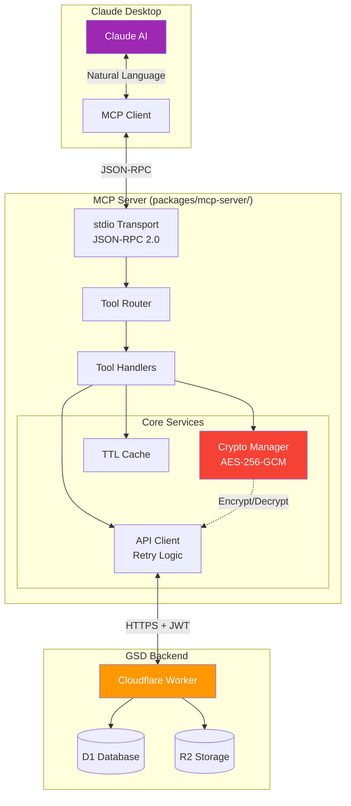

---

## Tool Organization

The MCP server provides 20 tools organized into 4 categories:

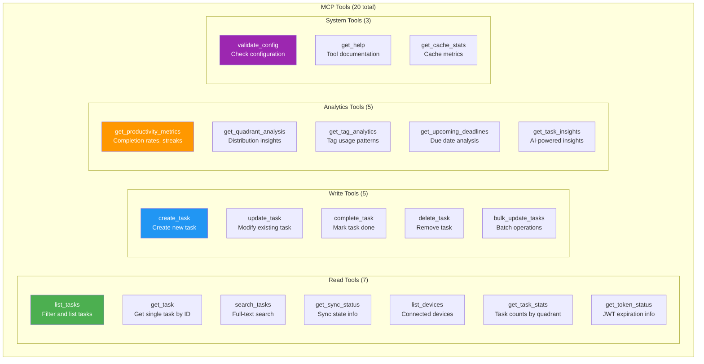

---

## Request Lifecycle

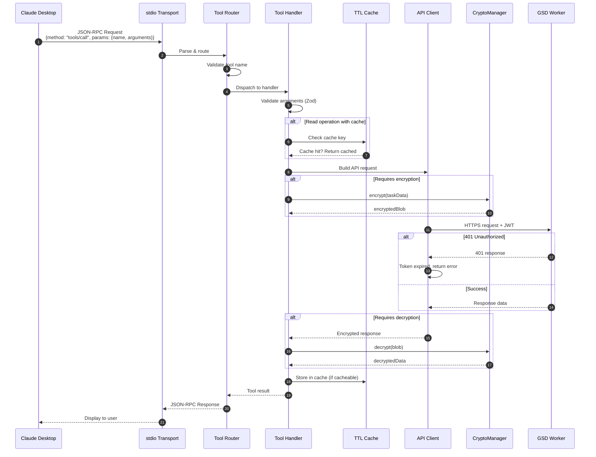

---

## Tool Handler Architecture

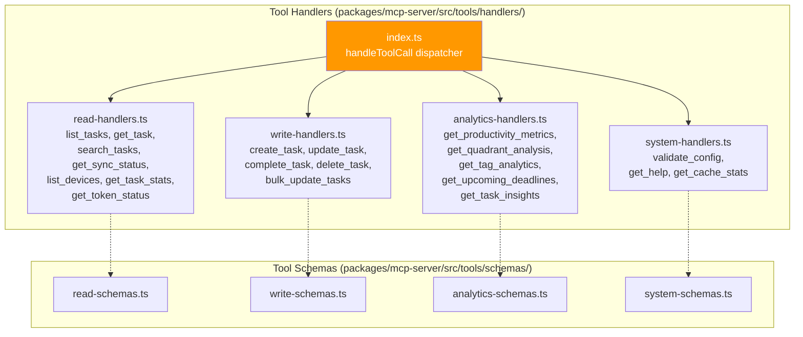

---

## Write Operation Flow (with Dry Run)

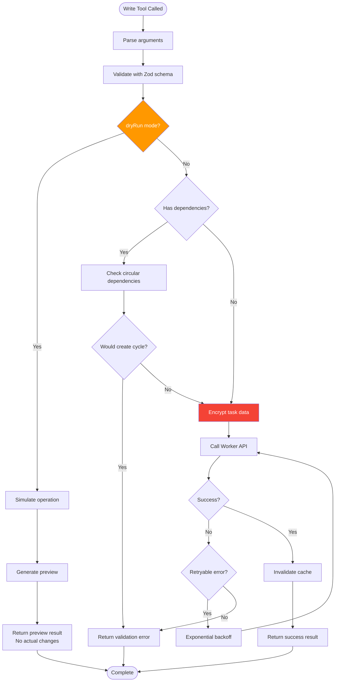

---

## Caching Strategy

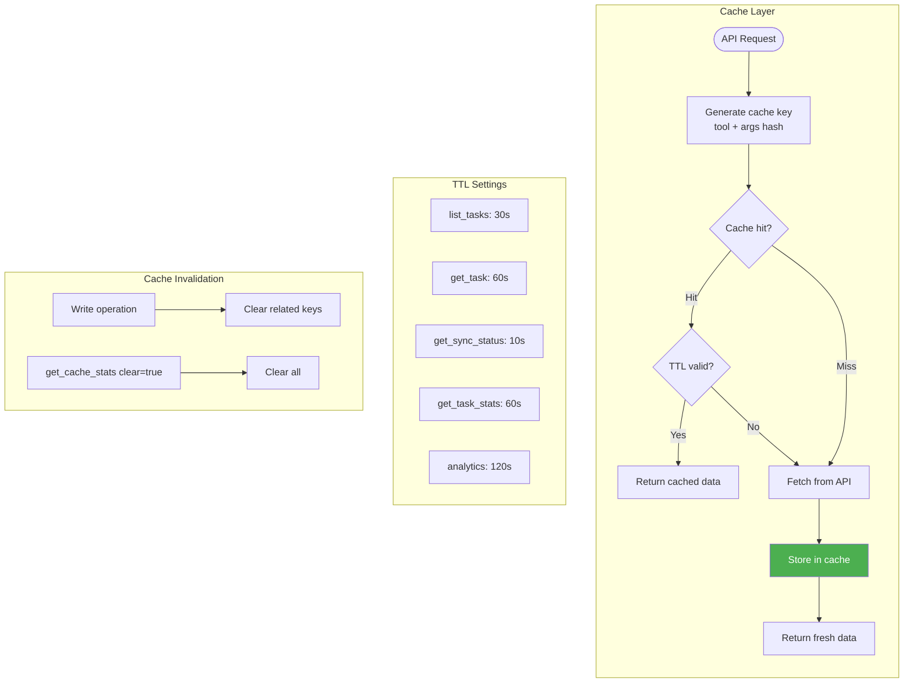

---

## Retry Logic with Exponential Backoff

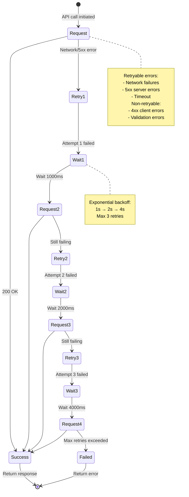

---

## Encryption/Decryption Flow

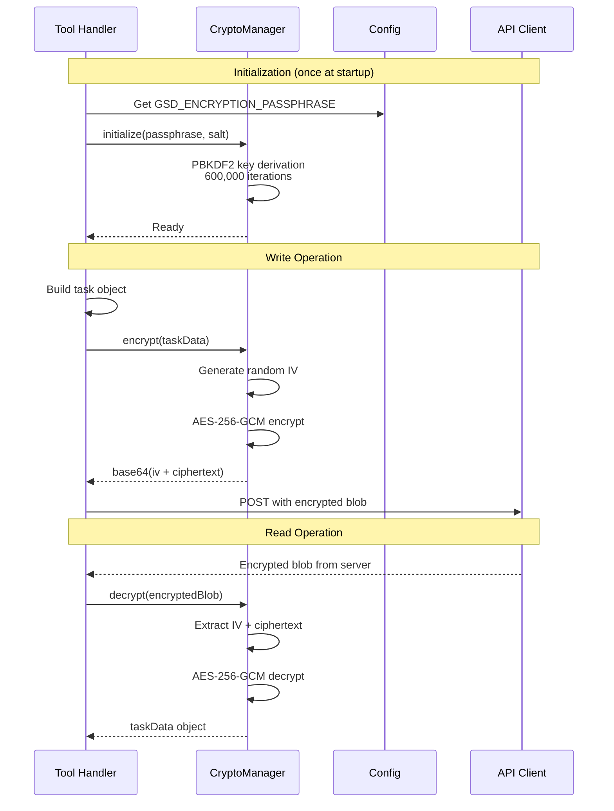

---

## Configuration Flow

```mermaid
flowchart TD
    subgraph "Configuration Sources"
        ENV[Environment Variables]
        CLAUDE_CONFIG[Claude Desktop Config<br/>~/Library/.../claude_desktop_config.json]
    end

    subgraph "Required Config"
        BASE_URL[GSD_API_BASE_URL<br/>Worker API endpoint]
        TOKEN[GSD_AUTH_TOKEN<br/>JWT from OAuth]
        PASSPHRASE[GSD_ENCRYPTION_PASSPHRASE<br/>User's encryption key]
    end

    subgraph "Optional Config"
        DEBUG[GSD_DEBUG<br/>Enable verbose logging]
        TIMEOUT[GSD_TIMEOUT<br/>API timeout (ms)]
    end

    ENV --> BASE_URL
    ENV --> TOKEN
    ENV --> PASSPHRASE
    ENV --> DEBUG
    ENV --> TIMEOUT

    CLAUDE_CONFIG --> ENV

    subgraph "Validation (validate_config tool)"
        V1[Check URL format]
        V2[Verify token structure]
        V3[Test API connectivity]
        V4[Verify encryption works]
    end

    BASE_URL --> V1
    TOKEN --> V2
    V1 --> V3
    PASSPHRASE --> V4

    V3 --> READY{All valid?}
    V4 --> READY

    READY -->|Yes| SUCCESS[Config valid]
    READY -->|No| ERRORS[Return validation errors]

    style PASSPHRASE fill:#F44336,color:white
    style TOKEN fill:#FF9800,color:white
```

---

## Tool Input/Output Schemas

### list_tasks

```mermaid
flowchart LR
    subgraph "Input"
        I1[quadrant?: string<br/>urgent-important, etc.]
        I2[status?: active|completed|all]
        I3[tags?: string[]]
        I4[limit?: number]
        I5[includeSubtasks?: boolean]
    end

    subgraph "Output"
        O1[tasks: Task[]]
        O2[count: number]
        O3[filters: AppliedFilters]
    end

    I1 --> HANDLER[list_tasks handler]
    I2 --> HANDLER
    I3 --> HANDLER
    I4 --> HANDLER
    I5 --> HANDLER

    HANDLER --> O1
    HANDLER --> O2
    HANDLER --> O3
```

### create_task

```mermaid
flowchart LR
    subgraph "Input"
        I1[title: string (required)]
        I2[description?: string]
        I3[urgent?: boolean]
        I4[important?: boolean]
        I5[dueDate?: ISO string]
        I6[tags?: string[]]
        I7[subtasks?: string[]]
        I8[dependencies?: string[]]
        I9[dryRun?: boolean]
    end

    subgraph "Output (dryRun=false)"
        O1[task: Task]
        O2[message: string]
    end

    subgraph "Output (dryRun=true)"
        O3[preview: Task]
        O4[wouldCreate: true]
        O5[validationPassed: boolean]
    end

    I1 --> HANDLER[create_task handler]
    I2 --> HANDLER
    I3 --> HANDLER
    I4 --> HANDLER
    I5 --> HANDLER
    I6 --> HANDLER
    I7 --> HANDLER
    I8 --> HANDLER
    I9 --> HANDLER

    HANDLER -->|dryRun=false| O1
    HANDLER -->|dryRun=false| O2
    HANDLER -->|dryRun=true| O3
    HANDLER -->|dryRun=true| O4
    HANDLER -->|dryRun=true| O5

    style I9 fill:#FF9800,color:white
```

---

## Error Handling

```mermaid
flowchart TD
    ERROR([Error Occurs]) --> TYPE{Error Type}

    TYPE -->|Validation| VAL[Zod validation error]
    TYPE -->|Network| NET[Network/timeout error]
    TYPE -->|Auth| AUTH[401/403 error]
    TYPE -->|Server| SRV[5xx server error]
    TYPE -->|Crypto| CRY[Decryption failed]
    TYPE -->|Unknown| UNK[Unexpected error]

    VAL --> FORMAT_VAL[Format field errors]
    NET --> RETRY_CHECK{Retries remaining?}

    RETRY_CHECK -->|Yes| RETRY[Retry with backoff]
    RETRY_CHECK -->|No| FORMAT_NET[Format network error]

    AUTH --> FORMAT_AUTH[Token expired message<br/>Suggest re-authentication]

    SRV --> RETRY_CHECK

    CRY --> FORMAT_CRY[Passphrase may be wrong]

    UNK --> FORMAT_UNK[Generic error message]

    FORMAT_VAL --> RESPONSE
    FORMAT_NET --> RESPONSE
    FORMAT_AUTH --> RESPONSE
    FORMAT_CRY --> RESPONSE
    FORMAT_UNK --> RESPONSE

    RESPONSE[JSON-RPC Error Response<br/>{isError: true, content: [...]}]

    style AUTH fill:#FF9800,color:white
    style CRY fill:#F44336,color:white
```

---

## MCP Protocol Messages

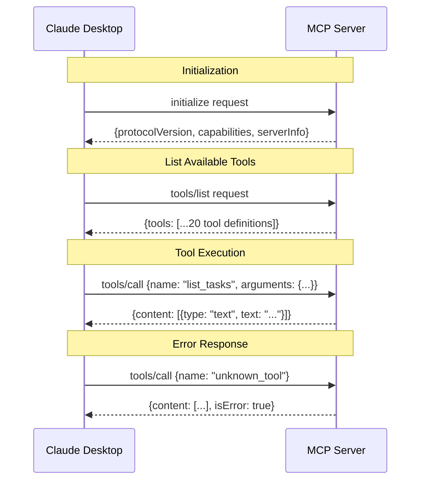

---

## File Structure

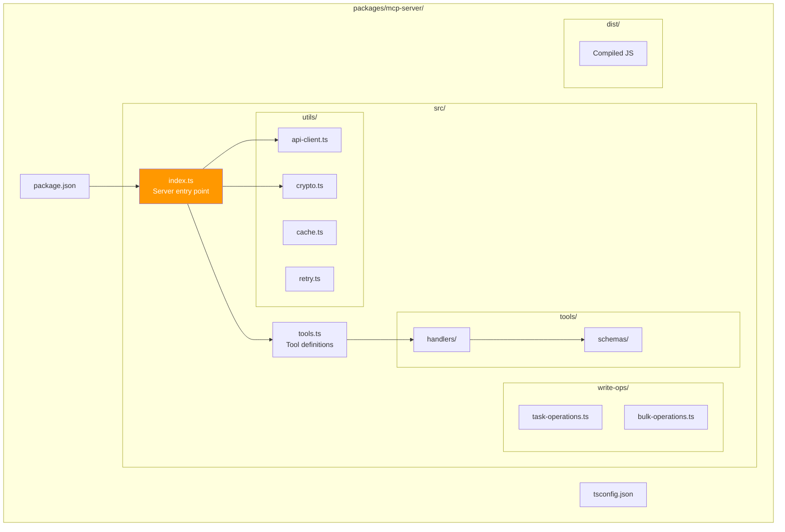

---

## Claude Desktop Integration

### Configuration Example

```json
{
  "mcpServers": {
    "gsd-tasks": {
      "command": "node",
      "args": ["/path/to/packages/mcp-server/dist/index.js"],
      "env": {
        "GSD_API_BASE_URL": "https://gsd-worker.example.com",
        "GSD_AUTH_TOKEN": "eyJhbG...",
        "GSD_ENCRYPTION_PASSPHRASE": "your-secret-passphrase"
      }
    }
  }
}
```

### Usage Flow

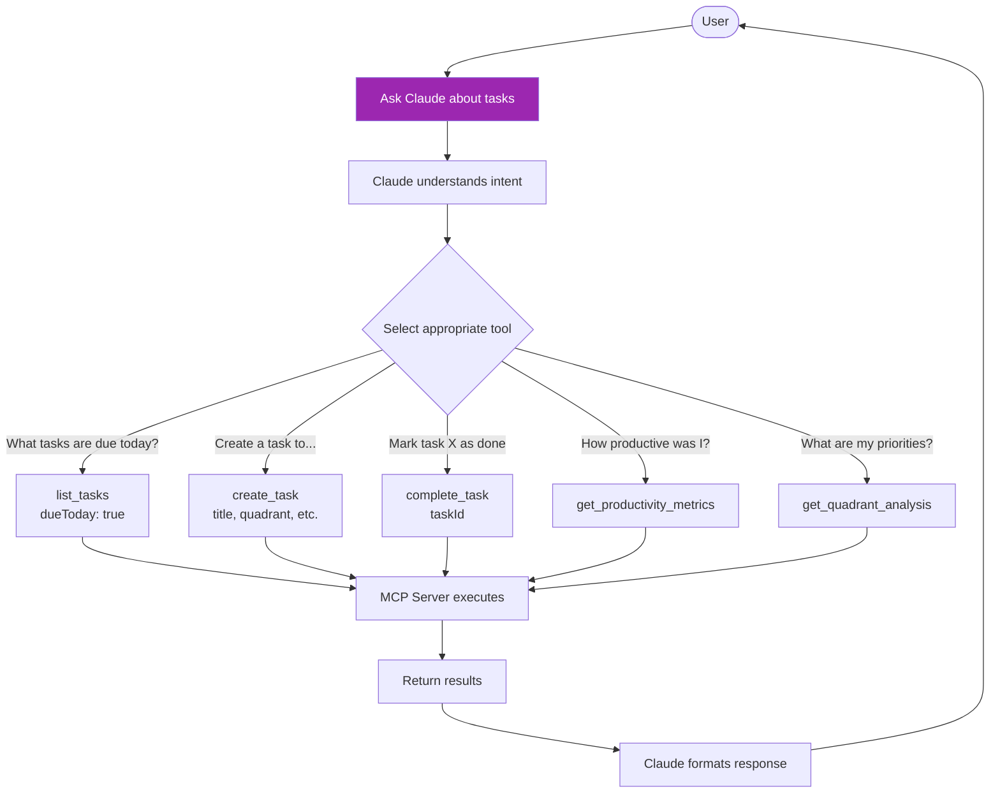

---

## Related Documentation

- **Sync Architecture:** `SYNC_ARCHITECTURE.md`
- **Worker Architecture:** `WORKER_ARCHITECTURE.md`
- **Database Architecture:** `DATABASE_ARCHITECTURE.md`
- **Project README:** `README.md`

## Code References

- **Server Entry:** `packages/mcp-server/src/index.ts`
- **Tool Definitions:** `packages/mcp-server/src/tools.ts`
- **Handlers:** `packages/mcp-server/src/tools/handlers/`
- **Schemas:** `packages/mcp-server/src/tools/schemas/`
- **API Client:** `packages/mcp-server/src/utils/api-client.ts`
- **Crypto Manager:** `packages/mcp-server/src/utils/crypto.ts`
