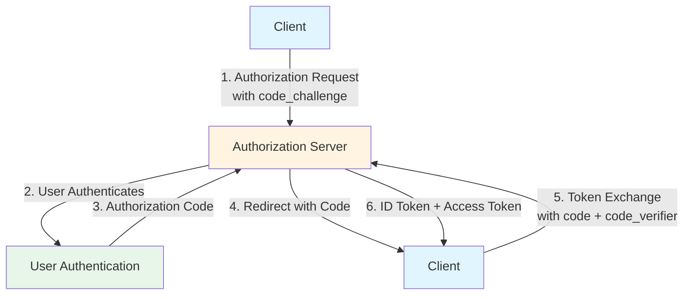
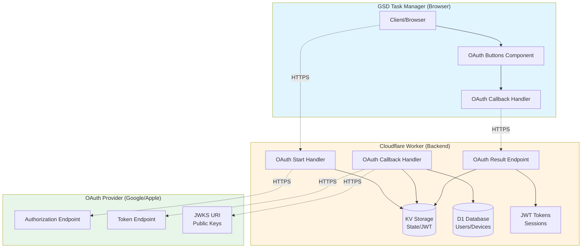
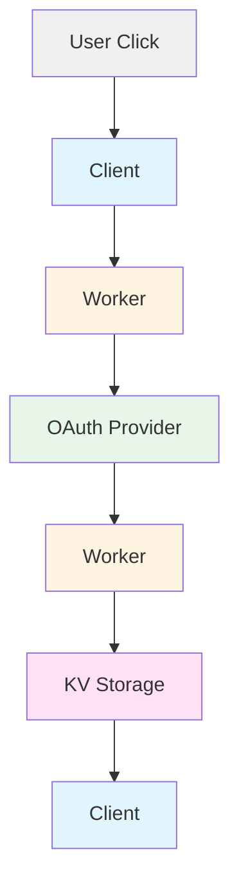
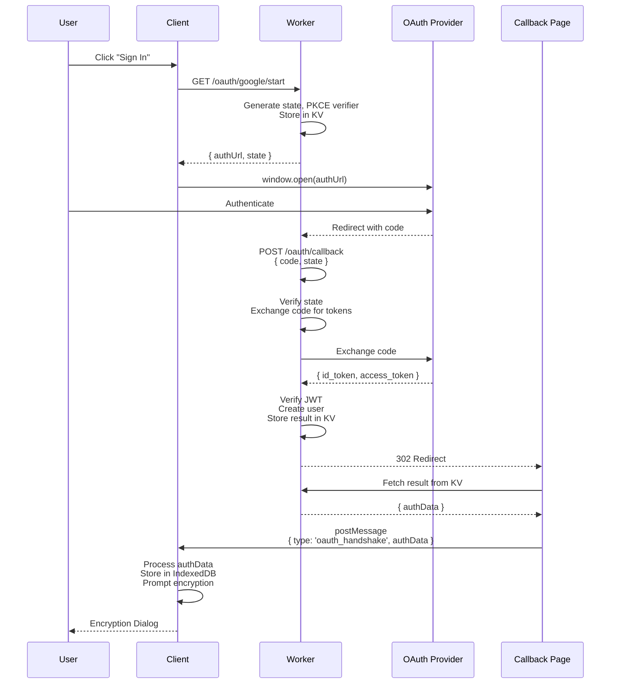
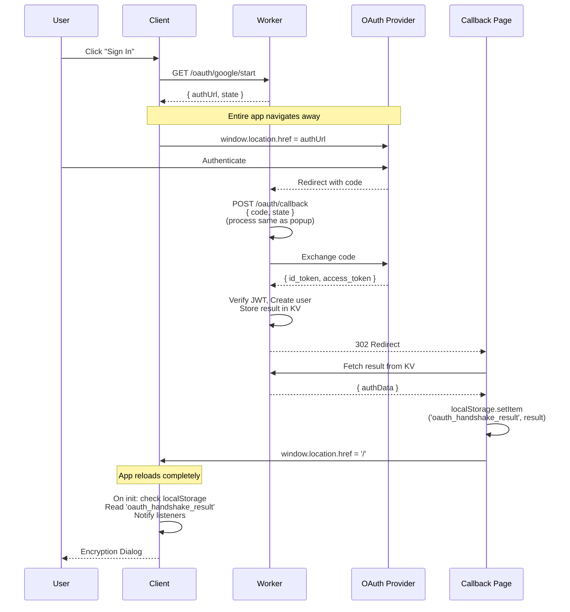

# OAuth 2.0 & OpenID Connect (OIDC) Implementation Guide
## GSD Task Manager Authentication Architecture

**Last Updated:** 2025-10-23
**Target Audience:** Developers, Security Auditors, Technical Documentation

---

## Table of Contents

1. [Introduction](#introduction)
2. [OAuth 2.0 & OIDC Fundamentals](#oauth-20--oidc-fundamentals)
3. [Why This Architecture?](#why-this-architecture)
4. [System Architecture Overview](#system-architecture-overview)
5. [Complete Authentication Flow](#complete-authentication-flow)
6. [Security Mechanisms](#security-mechanisms)
7. [Code Walkthrough](#code-walkthrough)
8. [PWA Considerations](#pwa-considerations)
9. [Testing & Troubleshooting](#testing--troubleshooting)
10. [References](#references)

---

## Introduction

GSD Task Manager implements a **privacy-first, end-to-end encrypted sync system** that uses OAuth 2.0 with OpenID Connect (OIDC) for secure user authentication. This document explains how OAuth and OIDC work in the application, why specific design decisions were made, and how all the pieces fit together.

### Key Features

- ✅ **OAuth 2.0 with OIDC** - Industry-standard authentication
- ✅ **PKCE (Proof Key for Code Exchange)** - Protects authorization code flow
- ✅ **State Token Handshake** - Secure result delivery without URL exposure
- ✅ **Multi-platform Support** - Desktop popups, iOS/Android PWA redirects
- ✅ **Zero Trust Design** - Secrets never exposed to client
- ✅ **E2E Encryption** - User data encrypted with passphrase-derived keys

### Supported Providers

- **Google OAuth 2.0** (primary)
- **Apple Sign In** (OIDC compliant)

---

## OAuth 2.0 & OIDC Fundamentals

### What is OAuth 2.0?

**OAuth 2.0** is an **authorization framework** (not authentication) that allows third-party applications to obtain limited access to a user's resources without exposing credentials.

**Key Concepts:**

- **Resource Owner**: The user who owns the data
- **Client**: The application requesting access (GSD Task Manager)
- **Authorization Server**: The OAuth provider (Google, Apple)
- **Resource Server**: Where the user's data lives (Google APIs, Apple APIs)
- **Access Token**: Credential used to access protected resources
- **Authorization Code**: Temporary code exchanged for tokens

### What is OpenID Connect (OIDC)?

**OIDC** is an **authentication layer** built on top of OAuth 2.0. It adds identity verification through **ID Tokens** (JSON Web Tokens / JWTs) that contain user information.

**Key Addition:**

- **ID Token**: JWT containing user identity claims (email, name, etc.)
- **UserInfo Endpoint**: Additional API to fetch user profile
- **Standard Scopes**: `openid`, `email`, `profile`

### OAuth 2.0 Flow Types

GSD uses the **Authorization Code Flow with PKCE**:



---

## Why This Architecture?

### Design Goals

1. **Security**: Never expose OAuth secrets or tokens in URLs
2. **Privacy**: E2E encryption with client-side passphrase
3. **Reliability**: Work across desktop, mobile web, and PWA
4. **Simplicity**: Single unified flow for popup and redirect modes
5. **Compliance**: Follow OWASP and OAuth 2.0 security best practices

### Key Challenges Solved

| Challenge | Solution |
|-----------|----------|
| OAuth secrets on client | Worker-only token exchange |
| Popup blockers | Graceful fallback to redirect |
| iOS PWA limitations | State handshake via localStorage + redirect |
| Token exposure in URLs | Store results in KV, fetch with state token |
| Replay attacks | Single-use state tokens with 30-minute TTL |
| Cross-tab communication | BroadcastChannel + postMessage + localStorage |

### Alternative Approaches (Not Used)

❌ **Implicit Flow**: Deprecated, tokens in URL fragments
❌ **Password Grant**: Requires managing passwords (against privacy-first goal)
❌ **Client Credentials**: No user context
✅ **Authorization Code + PKCE**: Most secure for public clients

---

## System Architecture Overview

### High-Level Components



### Data Flow



### Storage Locations

| Data | Location | Purpose | TTL |
|------|----------|---------|-----|
| State token | Worker KV | CSRF protection | 10 min |
| PKCE verifier | Worker KV | Code exchange proof | 10 min |
| OAuth result | Worker KV | Auth data delivery | 10 min (single-use) |
| User session | Worker KV | JWT validation | 7 days |
| Sync config | IndexedDB (client) | Device sync settings | Permanent |
| Encryption key | Memory only (client) | E2E encryption | Session |

---

## Complete Authentication Flow

### Phase 1: Initiation

**User Action:** Clicks "Continue with Google" or "Continue with Apple"

**Step-by-Step:**

1. **Client calls Worker:**
   ```typescript
   GET /api/auth/oauth/google/start
   Origin: https://gsd.vinny.dev
   ```

2. **Worker generates security tokens:**
   ```typescript
   // Generate cryptographically random tokens
   const state = generateRandomString(32);        // CSRF protection
   const codeVerifier = generateRandomString(64); // PKCE
   const codeChallenge = await SHA256(codeVerifier); // PKCE challenge
   ```

3. **Worker stores state in KV:**
   ```typescript
   await env.KV.put(`oauth_state:${state}`, JSON.stringify({
     codeVerifier,
     provider: 'google',
     redirectUri: 'https://gsd.vinny.dev/api/auth/oauth/callback',
     appOrigin: 'https://gsd.vinny.dev',
     createdAt: Date.now(),
   }), { expirationTtl: 1800 }); // 30 minutes
   ```

4. **Worker returns authorization URL:**
   ```json
   {
     "authUrl": "https://accounts.google.com/o/oauth2/v2/auth?client_id=...&redirect_uri=...&state=...&code_challenge=...",
     "state": "abc123..."
   }
   ```

5. **Client opens OAuth flow:**
   - **Desktop/Mobile Web:** Opens popup window
   - **iOS/Android PWA:** Redirects entire window (no popups available)

**Code Reference:** `components/sync/oauth-buttons.tsx:109-212`

---

### Phase 2: User Authentication

**OAuth Provider Action:** User authenticates with Google/Apple

**What Happens:**

1. User sees Google/Apple login screen
2. User enters credentials (or uses saved session)
3. User consents to requested scopes:
   - `openid` - OIDC identity
   - `email` - User email address
   - `profile` - Basic profile info

4. Provider validates credentials and consent

**Security Notes:**

- Credentials are **never** sent to GSD servers
- Provider issues authorization code (short-lived, single-use)
- Code is bound to `redirect_uri` and `code_challenge`

---

### Phase 3: Callback & Token Exchange

**OAuth Provider Action:** Redirects to Worker callback URL

**Step-by-Step:**

1. **Provider redirects to Worker:**
   ```
   GET https://gsd.vinny.dev/api/auth/oauth/callback?code=4/...&state=abc123...
   ```

2. **Worker validates state token:**
   ```typescript
   const stateData = await env.KV.get(`oauth_state:${state}`);
   if (!stateData) {
     return errorResponse('Invalid or expired state', 400);
   }
   await env.KV.delete(`oauth_state:${state}`); // Single-use
   ```

3. **Worker exchanges code for tokens:**
   ```typescript
   POST https://oauth2.googleapis.com/token
   Content-Type: application/x-www-form-urlencoded

   client_id={CLIENT_ID}
   &client_secret={CLIENT_SECRET}     // Worker secret, never exposed
   &code={AUTHORIZATION_CODE}
   &redirect_uri={REDIRECT_URI}
   &grant_type=authorization_code
   &code_verifier={PKCE_VERIFIER}     // Proves client owns code_challenge
   ```

4. **Provider returns tokens:**
   ```json
   {
     "access_token": "ya29...",
     "expires_in": 3599,
     "id_token": "eyJhbGciOiJSUzI1NiIs...",  // JWT with user info
     "token_type": "Bearer"
   }
   ```

5. **Worker verifies ID Token (JWT):**
   ```typescript
   import { jwtVerify, createRemoteJWKSet } from 'jose';

   const JWKS = createRemoteJWKSet(new URL('https://www.googleapis.com/oauth2/v3/certs'));
   const { payload } = await jwtVerify(idToken, JWKS, {
     issuer: 'https://accounts.google.com',
     audience: env.GOOGLE_CLIENT_ID,
   });

   const email = payload.email;
   const providerUserId = payload.sub;
   const emailVerified = payload.email_verified;
   ```

   **JWT Claims Decoded:**
   ```json
   {
     "iss": "https://accounts.google.com",
     "sub": "1234567890",  // Provider user ID
     "email": "user@example.com",
     "email_verified": true,
     "aud": "YOUR_CLIENT_ID.apps.googleusercontent.com",
     "exp": 1234567890,
     "iat": 1234567890
   }
   ```

6. **Worker creates or finds user:**
   ```typescript
   let user = await env.DB.prepare(
     'SELECT id, email, encryption_salt FROM users WHERE auth_provider = ? AND provider_user_id = ?'
   ).bind('google', providerUserId).first();

   if (!user) {
     // New user - create account
     const userId = generateId();
     await env.DB.prepare(
       'INSERT INTO users (id, email, auth_provider, provider_user_id, created_at) VALUES (?, ?, ?, ?, ?)'
     ).bind(userId, email, 'google', providerUserId, Date.now()).run();
   }
   ```

7. **Worker creates device & session:**
   ```typescript
   const deviceId = generateId();
   await env.DB.prepare(
     'INSERT INTO devices (id, user_id, device_name, last_seen_at) VALUES (?, ?, ?, ?)'
   ).bind(deviceId, user.id, 'Google Device', Date.now()).run();

   // Generate JWT for GSD sync API
   const { token, jti, expiresAt } = await createToken(
     user.id,
     user.email,
     deviceId,
     env.JWT_SECRET
   );

   // Store session in KV
   await env.KV.put(`session:${user.id}:${jti}`, JSON.stringify({
     deviceId,
     issuedAt: Date.now(),
     expiresAt,
   }), { expirationTtl: 604800 }); // 7 days
   ```

8. **Worker stores OAuth result in KV:**
   ```typescript
   const authData = {
     userId: user.id,
     deviceId,
     email: user.email,
     token,  // GSD JWT (not OAuth token!)
     expiresAt,
     requiresEncryptionSetup: !user.encryption_salt,
     encryptionSalt: user.encryption_salt || undefined,
     provider: 'google',
   };

   await env.KV.put(`oauth_result:${state}`, JSON.stringify({
     status: 'success',
     authData,
     createdAt: Date.now(),
   }), { expirationTtl: 1800 }); // 30 minutes, single-use
   ```

9. **Worker redirects to callback page:**
   ```typescript
   return new Response(null, {
     status: 302,
     headers: {
       'Location': 'https://gsd.vinny.dev/oauth-callback.html?success=true&state=abc123...',
     },
   });
   ```

**Code Reference:** `worker/src/handlers/oidc.ts:106-403`

---

### Phase 4: State Handshake & Result Delivery

**Callback Page Action:** Announces OAuth completion to app

**Why This Step Exists:**

- OAuth result contains sensitive data (JWT tokens, user IDs)
- **Problem:** Putting this in URL query params is insecure
- **Solution:** Store in KV, use state token as retrieval key

**Step-by-Step:**

1. **Callback page loads:**
   ```html
   <!-- /oauth-callback.html -->
   <script>
     const urlParams = new URLSearchParams(window.location.search);
     const success = urlParams.get('success');  // 'true' or 'false'
     const state = urlParams.get('state');      // State token
     const error = urlParams.get('error');      // Error message (if failed)
   </script>
   ```

2. **Callback page fetches OAuth result:**
   ```typescript
   const response = await fetch(
     `${workerUrl}/api/auth/oauth/result?state=${encodeURIComponent(state)}`,
     {
       method: 'GET',
       headers: { Accept: 'application/json' },
       credentials: 'omit',
     }
   );

   const data = await response.json();
   // { status: 'success', authData: { userId, token, email, ... } }
   ```

3. **Worker deletes result from KV (single-use):**
   ```typescript
   const resultKey = `oauth_result:${state}`;
   const resultStr = await env.KV.get(resultKey);
   await env.KV.delete(resultKey); // Prevent replay attacks
   return jsonResponse({ status: 'success', authData });
   ```

4. **Callback page broadcasts result:**

   The callback page uses **multiple broadcast mechanisms** to ensure the result reaches the app, regardless of browser/platform:

   ```typescript
   const result = {
     status: 'success',
     state: state,
     authData: data.authData
   };

   // 1. BroadcastChannel (modern browsers, same-origin)
   if (typeof BroadcastChannel !== 'undefined') {
     const channel = new BroadcastChannel('oauth-handshake');
     channel.postMessage(payload);
     channel.close();
   }

   // 2. postMessage to opener window (popup flow)
   if (window.opener && typeof window.opener.postMessage === 'function') {
     window.opener.postMessage(payload, window.location.origin);
   }

   // 3. localStorage (PWA redirect flow, Safari fallback)
   localStorage.setItem('oauth_handshake_result', JSON.stringify(result));
   ```

5. **Callback page closes or redirects:**
   - **Popup flow:** Closes window after 1 second
   - **PWA redirect flow:** Redirects to `/?oauth_complete=true`

**Code Reference:** `public/oauth-callback.html:139-393`

---

### Phase 5: App Processing

**App Action:** Listens for OAuth handshake, processes result

**Step-by-Step:**

1. **App subscribes to OAuth handshake events:**
   ```typescript
   // lib/sync/oauth-handshake.ts
   export function subscribeToOAuthHandshake(
     listener: (event: OAuthHandshakeEvent) => void
   ): () => void {
     ensureInitialized(); // Sets up BroadcastChannel, message listeners, storage events
     listeners.add(listener);
     return () => listeners.delete(listener);
   }
   ```

2. **Handshake system receives event:**

   The handshake system listens to **three event sources**:

   ```typescript
   // BroadcastChannel message
   broadcastChannel.addEventListener('message', (event) => {
     handleBroadcastPayload(event.data);
   });

   // postMessage from popup
   window.addEventListener('message', (event) => {
     if (event.data?.type === 'oauth_handshake') {
       handleBroadcastPayload(event.data);
     }
   });

   // localStorage change (PWA redirect)
   window.addEventListener('storage', (event) => {
     if (event.key === 'oauth_handshake_result' && event.newValue) {
       const result = JSON.parse(event.newValue);
       notifyListeners(result);
     }
   });
   ```

3. **On initialization, check for existing result:**

   **Critical for PWA mode:** When the OAuth callback redirects back to the app (`/?oauth_complete=true`), the app reloads completely. The result is already in localStorage, but no listeners have subscribed yet.

   ```typescript
   function ensureInitialized() {
     // ...

     // Check for existing OAuth result in localStorage
     const existingResult = localStorage.getItem('oauth_handshake_result');
     if (existingResult) {
       const result = JSON.parse(existingResult);

       if (!processedStates.has(result.state)) {
         processedStates.add(result.state);
         localStorage.removeItem('oauth_handshake_result'); // Clear

         // Delay to allow subscribers to register first
         setTimeout(() => notifyListeners(result), 100);
       }
     }
   }
   ```

4. **OAuth callback handler receives event:**
   ```typescript
   // components/oauth-callback-handler.tsx
   useEffect(() => {
     const unsubscribe = subscribeToOAuthHandshake(async (event) => {
       if (event.status === 'success') {
         await processAuthData(event.authData, event.state);
       } else {
         toast.error(event.error || 'Sign in failed');
       }
     });
     return unsubscribe;
   }, []);
   ```

5. **App stores sync config in IndexedDB:**
   ```typescript
   const db = getDb();
   await db.syncMetadata.put({
     key: 'sync_config',
     enabled: true,
     userId: authData.userId,
     deviceId: authData.deviceId,
     email: authData.email,
     token: authData.token,      // GSD JWT for sync API
     tokenExpiresAt: authData.expiresAt,
     provider: authData.provider,
     // ... other fields
   });
   ```

6. **App prompts for encryption passphrase:**
   ```typescript
   if (authData.requiresEncryptionSetup) {
     // New user - set up encryption
     setIsNewUser(true);
     setShowEncryptionDialog(true);
   } else {
     // Existing user - unlock encryption
     setIsNewUser(false);
     setShowEncryptionDialog(true);
   }
   ```

7. **User enters passphrase:**
   - **New user:** Creates encryption key, derives salt, stores locally
   - **Existing user:** Unlocks with existing passphrase and server salt

8. **Encryption key derived:**
   ```typescript
   // lib/sync/crypto.ts
   const cryptoManager = new CryptoManager();
   await cryptoManager.deriveKey(passphrase, salt);
   // Encryption key is stored in memory only, never persisted
   ```

9. **Sync enabled:**
   - User can now push/pull encrypted tasks to/from Worker
   - Manual sync via cloud icon, or automatic background sync

**Code Reference:** `components/oauth-callback-handler.tsx:1-148`

---

## Security Mechanisms

### 1. PKCE (Proof Key for Code Exchange)

**Purpose:** Prevents authorization code interception attacks

**How It Works:**

```typescript
// Step 1: Client generates random verifier
const codeVerifier = generateRandomString(64);
// Example: "dBjftJeZ4CVP-mB92K27uhbUJU1p1r_wW1gFWFOEjXk"

// Step 2: Client hashes verifier to create challenge
const codeChallenge = await SHA256(codeVerifier);
// Example: "E9Melhoa2OwvFrEMTJguCHaoeK1t8URWbuGJSstw-cM"

// Step 3: Client sends challenge to authorization endpoint
// redirect to: /authorize?code_challenge=E9Melh...&code_challenge_method=S256

// Step 4: Provider redirects with code
// redirect to: /callback?code=4/P7q7W91...

// Step 5: Client exchanges code + verifier for tokens
// POST /token with: code=4/P7q7W91...&code_verifier=dBjftJeZ...

// Step 6: Provider verifies: SHA256(verifier) === stored challenge
// If valid, issues tokens
```

**Why It Matters:**

- Without PKCE, attacker intercepts code and exchanges it for tokens
- With PKCE, attacker needs both code AND verifier (impossible without access to client)

**Standard:** RFC 7636

---

### 2. State Tokens (CSRF Protection)

**Purpose:** Prevent Cross-Site Request Forgery attacks

**How It Works:**

```typescript
// Generate cryptographically random state
const state = crypto.getRandomValues(new Uint8Array(32));
// "7f3d9c2e8a1b5f4c9d0e2a7b8c3f1d6e2a9b4c5d7e3f8a1b2c4d5e6f7a8b9c0d"

// Store in KV with short TTL
await env.KV.put(`oauth_state:${state}`, JSON.stringify({
  codeVerifier,
  provider,
  createdAt: Date.now(),
}), { expirationTtl: 600 });

// Send to provider in authorization URL
// /authorize?state=7f3d9c2e...

// Provider echoes state in callback
// /callback?code=...&state=7f3d9c2e...

// Verify state matches and delete
const stored = await env.KV.get(`oauth_state:${state}`);
if (!stored) throw new Error('Invalid state');
await env.KV.delete(`oauth_state:${state}`);
```

**Attack Scenario Prevented:**

1. Attacker tricks user into clicking malicious link
2. Link initiates OAuth flow with attacker's state
3. User authenticates, provider redirects to callback
4. App verifies state token, rejects if not in KV
5. Attacker cannot forge valid state token

---

### 3. Single-Use OAuth Results

**Purpose:** Prevent replay attacks

**How It Works:**

```typescript
// Worker stores result in KV
await env.KV.put(`oauth_result:${state}`, JSON.stringify({
  status: 'success',
  authData: { userId, token, ... },
}), { expirationTtl: 600 });

// Client fetches result
const result = await env.KV.get(`oauth_result:${state}`);

// Worker IMMEDIATELY deletes result
await env.KV.delete(`oauth_result:${state}`);

// Second fetch returns 410 Gone
const secondAttempt = await env.KV.get(`oauth_result:${state}`);
// null - result already consumed
```

**Attack Scenario Prevented:**

1. Attacker intercepts state token from localStorage
2. Attacker tries to fetch OAuth result
3. Result already consumed by legitimate client
4. Attacker gets 410 Gone error

---

### 4. Origin Validation

**Purpose:** Prevent postMessage hijacking

**How It Works:**

```typescript
// Allowed origins whitelist
export const ALLOWED_OAUTH_ORIGINS = [
  'https://gsd.vinny.dev',
  'https://gsd-dev.vinny.dev',
  'http://localhost:3000',
  'http://localhost:8787',
];

// Validate message origin
window.addEventListener('message', (event) => {
  if (!isOAuthOriginAllowed(event.origin)) {
    console.warn('Rejected message from untrusted origin:', event.origin);
    return;
  }

  // Process message
  handleBroadcastPayload(event.data);
});
```

**Attack Scenario Prevented:**

1. Attacker creates malicious iframe on different domain
2. Attacker tries to send fake OAuth success message
3. App checks origin, rejects if not in whitelist
4. Fake message ignored

**Code Reference:** `lib/oauth-config.ts:8-67`

---

### 5. JWT Verification (ID Token)

**Purpose:** Verify OAuth provider issued the ID token

**How It Works:**

```typescript
import { jwtVerify, createRemoteJWKSet } from 'jose';

// Step 1: Fetch provider's public keys
const JWKS = createRemoteJWKSet(
  new URL('https://www.googleapis.com/oauth2/v3/certs')
);

// Step 2: Verify JWT signature, issuer, audience, expiration
const { payload } = await jwtVerify(idToken, JWKS, {
  issuer: 'https://accounts.google.com',
  audience: env.GOOGLE_CLIENT_ID,
  // Automatically checks exp (expiration), iat (issued at)
});

// Step 3: Extract verified claims
const email = payload.email;
const emailVerified = payload.email_verified;
```

**What Gets Verified:**

- ✅ **Signature**: JWT signed by provider's private key
- ✅ **Issuer**: `iss` claim matches expected issuer
- ✅ **Audience**: `aud` claim matches our client ID
- ✅ **Expiration**: `exp` claim is in the future
- ✅ **Not Before**: `nbf` claim is in the past (if present)

**Attack Scenario Prevented:**

1. Attacker creates fake ID token with stolen user info
2. Attacker sends to our token exchange endpoint
3. JWT verification fails (invalid signature)
4. Request rejected

**Standard:** RFC 7519 (JWT), RFC 7515 (JWS)

---

### 6. Encryption Salt Management

**Purpose:** Secure E2E encryption key derivation

**How It Works:**

**New User Flow:**

```typescript
// Client generates encryption salt locally
const salt = crypto.getRandomValues(new Uint8Array(32));
const saltBase64 = btoa(String.fromCharCode(...salt));

// Derive encryption key from passphrase + salt
await cryptoManager.deriveKey(passphrase, saltBase64);

// Send salt to worker for storage
POST /api/sync/encryption/setup
{ salt: saltBase64 }

// Worker stores salt in D1
UPDATE users SET encryption_salt = ? WHERE id = ?
```

**Existing User Flow:**

```typescript
// OAuth result includes existing salt
const authData = {
  userId,
  token,
  encryptionSalt: user.encryption_salt, // From D1
  requiresEncryptionSetup: false,
};

// Client retrieves salt, prompts for passphrase
await cryptoManager.deriveKey(passphrase, authData.encryptionSalt);

// If passphrase wrong, decryption fails
const decrypted = await cryptoManager.decrypt(encryptedTask);
// Throws error if passphrase incorrect
```

**Security Properties:**

- ✅ Salt stored on server (enables passphrase recovery on new device)
- ✅ Passphrase never sent to server
- ✅ Encryption key derived client-side only
- ✅ Server cannot decrypt user data (zero-knowledge)

**Algorithm:** PBKDF2 with 600,000 iterations (OWASP 2023 recommendation)

**Code Reference:** `lib/sync/crypto.ts:1-100`

---

## Code Walkthrough

### Client-Side Components

#### 1. OAuth Buttons (`components/sync/oauth-buttons.tsx`)

**Purpose:** Initiate OAuth flow

**Key Functions:**

```typescript
const handleOAuth = async (provider: 'google' | 'apple') => {
  // Step 1: Determine flow type (popup vs redirect)
  const usePopup = canUsePopups(); // Detects PWA mode, iOS, popup blockers

  // Step 2: Request OAuth start from worker
  const response = await fetch(`${WORKER_URL}/api/auth/oauth/${provider}/start`);
  const { authUrl, state } = await response.json();

  // Step 3: Track pending state
  pendingStates.current.set(state, {
    timestamp: Date.now(),
    provider,
    popup: null,
  });

  // Step 4: Open OAuth flow
  if (usePopup) {
    const popup = window.open(authUrl, `${provider}_oauth`, 'width=500,height=600');
    pendingStates.current.set(state, { ...state, popup });
  } else {
    window.location.href = authUrl; // Redirect entire window (PWA)
  }
};
```

**Cleanup Logic:**

```typescript
useEffect(() => {
  // Clean up expired states every 1 minute
  const cleanupInterval = setInterval(() => {
    const now = Date.now();
    pendingStates.current.forEach((state, key) => {
      if (now - state.timestamp > 1_800_000) { // 30 minutes
        state.popup?.close();
        pendingStates.current.delete(key);
      }
    });
  }, 60_000);

  return () => clearInterval(cleanupInterval);
}, []);
```

---

#### 2. OAuth Handshake (`lib/sync/oauth-handshake.ts`)

**Purpose:** Unified broadcast/listen system for OAuth results

**Initialization:**

```typescript
function ensureInitialized() {
  if (isInitialized) return;
  isInitialized = true;

  // Set up BroadcastChannel
  if ('BroadcastChannel' in window) {
    broadcastChannel = new BroadcastChannel('oauth-handshake');
    broadcastChannel.addEventListener('message', (event) => {
      handleBroadcastPayload(event.data);
    });
  }

  // Set up postMessage listener
  window.addEventListener('message', handleMessageEvent);

  // Set up storage listener
  window.addEventListener('storage', handleStorageEvent);

  // Check for existing result (PWA mode)
  const existingResult = localStorage.getItem('oauth_handshake_result');
  if (existingResult) {
    const result = JSON.parse(existingResult);
    if (!processedStates.has(result.state)) {
      processedStates.add(result.state);
      localStorage.removeItem('oauth_handshake_result');
      setTimeout(() => notifyListeners(result), 100);
    }
  }
}
```

**Subscription:**

```typescript
export function subscribeToOAuthHandshake(
  listener: (event: OAuthHandshakeEvent) => void
): () => void {
  ensureInitialized();
  listeners.add(listener);
  return () => listeners.delete(listener);
}
```

**Broadcasting (from callback page):**

```typescript
export function announceOAuthState(state: string, success: boolean, error?: string) {
  const result = await fetchOAuthResult(state);
  processedStates.add(state);

  const payload = {
    type: 'oauth_handshake',
    state,
    success,
    error: error || null,
    timestamp: Date.now(),
    result,
  };

  // BroadcastChannel
  if (broadcastChannel) {
    broadcastChannel.postMessage(payload);
  }

  // postMessage to opener
  if (window.opener) {
    window.opener.postMessage(payload, window.location.origin);
  }

  // localStorage
  localStorage.setItem('oauth_handshake_result', JSON.stringify(result));
  localStorage.setItem('oauth_handshake_state', JSON.stringify(payload));

  // Notify local listeners
  notifyListeners(result);
}
```

---

#### 3. OAuth Callback Handler (`components/oauth-callback-handler.tsx`)

**Purpose:** Process OAuth result, store sync config, prompt for encryption

**Main Logic:**

```typescript
export function OAuthCallbackHandler() {
  useEffect(() => {
    const unsubscribe = subscribeToOAuthHandshake(async (event) => {
      if (event.status === 'success') {
        await processAuthData(event.authData, event.state);
      } else {
        toast.error(event.error);
      }
    });
    return unsubscribe;
  }, []);

  const processAuthData = async (authData, state) => {
    // Store sync config in IndexedDB
    const db = getDb();
    await db.syncMetadata.put({
      key: 'sync_config',
      enabled: true,
      userId: authData.userId,
      deviceId: authData.deviceId,
      email: authData.email,
      token: authData.token,
      tokenExpiresAt: authData.expiresAt,
      provider: authData.provider,
    });

    // Determine encryption setup flow
    const hasEncryption = await isEncryptionConfigured();
    if (authData.requiresEncryptionSetup || !hasEncryption) {
      setIsNewUser(true);  // Create new encryption key
    } else {
      setIsNewUser(false); // Unlock existing encryption
    }
    setShowEncryptionDialog(true);
  };

  return (
    <EncryptionPassphraseDialog
      isOpen={showEncryptionDialog}
      isNewUser={isNewUser}
      onComplete={() => {
        setShowEncryptionDialog(false);
        toast.success('Sync enabled successfully!');
      }}
    />
  );
}
```

---

### Worker-Side Handlers

#### 1. Initiate OAuth (`worker/src/handlers/oidc.ts:15-100`)

**Key Steps:**

```typescript
export async function initiateOAuth(request, env, provider) {
  // Get OAuth config
  const config = provider === 'google' ? GOOGLE_CONFIG : APPLE_CONFIG;
  const clientId = env.GOOGLE_CLIENT_ID;

  // Determine callback URIs
  const requestUrl = new URL(request.url);
  const workerCallbackUri = `${requestUrl.origin}/api/auth/oauth/callback`;
  const appOrigin = env.OAUTH_CALLBACK_BASE || request.headers.get('Origin');

  // Generate security tokens
  const state = generateRandomString(32);
  const codeVerifier = generateRandomString(64);
  const codeChallenge = await generateCodeChallenge(codeVerifier);

  // Store state in KV
  await env.KV.put(`oauth_state:${state}`, JSON.stringify({
    codeVerifier,
    provider,
    redirectUri: workerCallbackUri,
    appOrigin,
    createdAt: Date.now(),
  }), { expirationTtl: 600 });

  // Build authorization URL
  const authUrl = new URL(config.authorization_endpoint);
  authUrl.searchParams.set('client_id', clientId);
  authUrl.searchParams.set('redirect_uri', workerCallbackUri);
  authUrl.searchParams.set('response_type', 'code');
  authUrl.searchParams.set('scope', config.scope);
  authUrl.searchParams.set('state', state);
  authUrl.searchParams.set('code_challenge', codeChallenge);
  authUrl.searchParams.set('code_challenge_method', 'S256');

  return jsonResponse({ authUrl: authUrl.toString(), state });
}
```

---

#### 2. Handle OAuth Callback (`worker/src/handlers/oidc.ts:106-403`)

**Token Exchange:**

```typescript
// Exchange code for tokens
const tokenResponse = await fetch(config.token_endpoint, {
  method: 'POST',
  headers: { 'Content-Type': 'application/x-www-form-urlencoded' },
  body: new URLSearchParams({
    client_id: clientId,
    client_secret: env.GOOGLE_CLIENT_SECRET,
    code,
    redirect_uri: redirectUri,
    grant_type: 'authorization_code',
    code_verifier: codeVerifier,
  }),
});

const tokens = await tokenResponse.json();
const idToken = tokens.id_token;
```

**JWT Verification:**

```typescript
const JWKS = createRemoteJWKSet(new URL(config.jwks_uri));
const { payload } = await jwtVerify(idToken, JWKS, {
  issuer: config.issuer,
  audience: clientId,
});

const email = payload.email;
const providerUserId = payload.sub;
const emailVerified = payload.email_verified;

if (!emailVerified) {
  return errorResponse('Email not verified', 400);
}
```

**User Creation:**

```typescript
let user = await env.DB.prepare(
  'SELECT id, email, encryption_salt FROM users WHERE auth_provider = ? AND provider_user_id = ?'
).bind(provider, providerUserId).first();

if (!user) {
  const userId = generateId();
  await env.DB.prepare(
    'INSERT INTO users (id, email, auth_provider, provider_user_id, created_at) VALUES (?, ?, ?, ?, ?)'
  ).bind(userId, email, provider, providerUserId, Date.now()).run();

  user = { id: userId, email };
}
```

**Device & Session:**

```typescript
const deviceId = generateId();
await env.DB.prepare(
  'INSERT INTO devices (id, user_id, device_name, last_seen_at) VALUES (?, ?, ?, ?)'
).bind(deviceId, user.id, 'Google Device', Date.now()).run();

const { token, jti, expiresAt } = await createToken(
  user.id,
  user.email,
  deviceId,
  env.JWT_SECRET
);

await env.KV.put(`session:${user.id}:${jti}`, JSON.stringify({
  deviceId,
  issuedAt: Date.now(),
  expiresAt,
}), { expirationTtl: 604800 });
```

**Store Result & Redirect:**

```typescript
await env.KV.put(`oauth_result:${state}`, JSON.stringify({
  status: 'success',
  authData: {
    userId: user.id,
    deviceId,
    email: user.email,
    token,
    expiresAt,
    requiresEncryptionSetup: !user.encryption_salt,
    encryptionSalt: user.encryption_salt,
    provider,
  },
}), { expirationTtl: 600 });

return new Response(null, {
  status: 302,
  headers: {
    'Location': `${appOrigin}/oauth-callback.html?success=true&state=${state}`,
  },
});
```

---

#### 3. Get OAuth Result (`worker/src/handlers/oidc.ts:409-459`)

**Purpose:** Retrieve and delete OAuth result (single-use)

```typescript
export async function getOAuthResult(request, env) {
  const url = new URL(request.url);
  const state = url.searchParams.get('state');

  if (!state) {
    return errorResponse('Missing state parameter', 400);
  }

  const resultKey = `oauth_result:${state}`;
  const resultStr = await env.KV.get(resultKey);

  if (!resultStr) {
    return jsonResponse({
      status: 'expired',
      message: 'OAuth result not found or expired',
    }, 410);
  }

  // DELETE result immediately (single-use)
  await env.KV.delete(resultKey);

  const result = JSON.parse(resultStr);
  return jsonResponse(result);
}
```

---

## PWA Considerations

### Challenge: iOS Standalone Mode

**Problem:**

- iOS PWAs run in "standalone mode" (no browser chrome)
- `window.open()` **does not work** in standalone mode
- Popups are not supported
- OAuth must use redirect flow

**Solution:**

```typescript
function isStandalonePWA() {
  // iOS Safari standalone mode
  const isIOSStandalone = ('standalone' in window.navigator) &&
                          window.navigator.standalone === true;

  // Standard PWA display mode
  const isDisplayStandalone = window.matchMedia('(display-mode: standalone)').matches;

  return isIOSStandalone || isDisplayStandalone;
}

// In OAuth flow
if (isStandalonePWA()) {
  // Redirect entire window
  window.location.href = authUrl;
} else {
  // Open popup
  window.open(authUrl, '_blank');
}
```

---

### Challenge: Redirect Causes Page Reload

**Problem:**

- OAuth redirects back to `https://gsd.vinny.dev/oauth-callback.html`
- PWA then redirects to `https://gsd.vinny.dev/?oauth_complete=true`
- **Entire app reloads** - all state lost
- Listeners not registered yet

**Solution: Pre-store Result in localStorage**

```typescript
// In oauth-callback.html
const result = await fetchOAuthResult(state);

// Store in localStorage BEFORE redirecting
localStorage.setItem('oauth_handshake_result', JSON.stringify(result));

// Redirect to app
window.location.href = '/?oauth_complete=true';
```

```typescript
// In oauth-handshake.ts initialization
function ensureInitialized() {
  // Check for existing result
  const existingResult = localStorage.getItem('oauth_handshake_result');
  if (existingResult) {
    const result = JSON.parse(existingResult);
    localStorage.removeItem('oauth_handshake_result');

    // Delay to let listeners register first
    setTimeout(() => notifyListeners(result), 100);
  }
}
```

---

### Challenge: BroadcastChannel Not Supported

**Problem:**

- Safari < 15.4 doesn't support BroadcastChannel
- iOS Safari standalone has spotty support

**Solution: Triple-Redundancy**

```typescript
// 1. BroadcastChannel (modern browsers)
if ('BroadcastChannel' in window) {
  const channel = new BroadcastChannel('oauth-handshake');
  channel.postMessage(payload);
}

// 2. postMessage (popup flow)
if (window.opener) {
  window.opener.postMessage(payload, window.location.origin);
}

// 3. localStorage + storage event (fallback)
localStorage.setItem('oauth_handshake_result', JSON.stringify(payload));

// Listen to all three
broadcastChannel.addEventListener('message', handleMessage);
window.addEventListener('message', handleMessage);
window.addEventListener('storage', handleMessage);
```

---

## Testing & Troubleshooting

### Unit Tests

**OAuth Security Tests:**

```bash
bun test tests/security/oauth-security.test.ts
```

**Coverage:**

```typescript
describe('OAuth Security', () => {
  it('validates state tokens', () => {
    const state = generateRandomString(32);
    expect(state.length).toBeGreaterThanOrEqual(32);
  });

  it('rejects invalid origins', () => {
    expect(isOAuthOriginAllowed('https://evil.com')).toBe(false);
  });

  it('accepts valid origins', () => {
    expect(isOAuthOriginAllowed('https://gsd.vinny.dev')).toBe(true);
  });

  it('validates OAuth messages', () => {
    const result = validateOAuthMessage({
      type: 'oauth_success',
      state: 'a'.repeat(32),
      authData: {
        userId: '123',
        deviceId: '456',
        email: 'user@example.com',
        token: 'token',
        expiresAt: Date.now() + 3600000,
        requiresEncryptionSetup: false,
        provider: 'google',
      },
    });
    expect(result.success).toBe(true);
  });
});
```

---

### Manual Testing Checklist

#### Desktop Popup Flow

- [ ] Click "Continue with Google"
- [ ] Popup opens with Google login
- [ ] User authenticates
- [ ] Popup closes automatically
- [ ] Encryption dialog appears
- [ ] Enter passphrase
- [ ] Sync enabled

#### iOS PWA Redirect Flow

- [ ] Install PWA on iOS device
- [ ] Open from home screen
- [ ] Click "Continue with Google"
- [ ] Redirects to Google login (no popup)
- [ ] User authenticates
- [ ] Redirects back to app
- [ ] Encryption dialog appears
- [ ] Enter passphrase
- [ ] Sync enabled

#### Error Scenarios

- [ ] Revoke OAuth redirect URI → error shown in callback page
- [ ] Network error during token exchange → error shown to user
- [ ] Invalid state token → 400 error from worker
- [ ] Expired state token → error shown to user
- [ ] Second attempt to fetch result → 410 Gone

---

### Debugging Tools

**Client-Side Logging:**

```typescript
// Enable verbose OAuth logging
localStorage.setItem('oauth_debug', 'true');

// View logs in browser console
// [OAuth] Initiating flow: { provider: 'google', usePopup: true, ... }
// [OAuthHandshake] Broadcast received: { state: 'abc123...', success: true }
// [OAuthCallbackHandler] Processing OAuth handshake result: { email: '...', ... }
```

**Worker-Side Logging:**

```bash
# Tail worker logs in real-time
npx wrangler tail --env production

# Filter for OAuth events
npx wrangler tail --env production | grep OAuth
```

**KV Inspection:**

```bash
# List all OAuth states
npx wrangler kv:key list --namespace-id=<KV_ID> --prefix="oauth_state:"

# Get specific state
npx wrangler kv:key get "oauth_state:abc123..." --namespace-id=<KV_ID>

# List all OAuth results
npx wrangler kv:key list --namespace-id=<KV_ID> --prefix="oauth_result:"
```

---

### Common Issues

#### Issue: Popup Blocked

**Symptom:** Click "Continue with Google", nothing happens

**Cause:** Browser blocking popups

**Solution:**
- Check browser console for popup blocker warning
- Allow popups for `gsd.vinny.dev`
- Or use redirect flow (set `FORCE_REDIRECT=true`)

---

#### Issue: "Invalid state" Error

**Symptom:** Callback fails with "Invalid or expired state"

**Cause:** State token expired (>30 minutes) or already used

**Solution:**
- Click "Continue with Google" again
- Don't refresh OAuth provider page during flow
- Check worker KV for `oauth_state:*` keys

---

#### Issue: OAuth Result Not Found

**Symptom:** Callback fetches result, gets 410 Gone

**Cause:** Result already consumed or expired

**Solution:**
- Check if multiple tabs are open (duplicate fetch)
- Verify result TTL in worker (should be 600 seconds)
- Check worker logs for result storage

---

#### Issue: Encryption Dialog Not Showing

**Symptom:** OAuth succeeds, but no encryption prompt

**Cause:** OAuthCallbackHandler not mounted or listener not registered

**Solution:**
- Verify `<OAuthCallbackHandler />` in app layout
- Check browser console for errors
- Verify `subscribeToOAuthHandshake` is called

---

## References

### OAuth 2.0 & OIDC Specifications

- [RFC 6749: OAuth 2.0 Authorization Framework](https://datatracker.ietf.org/doc/html/rfc6749)
- [RFC 7636: PKCE (Proof Key for Code Exchange)](https://datatracker.ietf.org/doc/html/rfc7636)
- [RFC 7519: JSON Web Token (JWT)](https://datatracker.ietf.org/doc/html/rfc7519)
- [OpenID Connect Core 1.0](https://openid.net/specs/openid-connect-core-1_0.html)

### Security Best Practices

- [OWASP OAuth 2.0 Security Cheat Sheet](https://cheatsheetseries.owasp.org/cheatsheets/OAuth2_Cheat_Sheet.html)
- [OAuth 2.0 Security Best Current Practice (BCP)](https://datatracker.ietf.org/doc/html/draft-ietf-oauth-security-topics)
- [OWASP PBKDF2 Recommendations](https://cheatsheetseries.owasp.org/cheatsheets/Password_Storage_Cheat_Sheet.html)

### Provider Documentation

- [Google OAuth 2.0 for Web Apps](https://developers.google.com/identity/protocols/oauth2/web-server)
- [Google OAuth 2.0 PKCE](https://developers.google.com/identity/protocols/oauth2/native-app#step-2-send-a-request-to-googles-oauth-20-server)
- [Apple Sign In Documentation](https://developer.apple.com/documentation/sign_in_with_apple)

### Libraries Used

- [jose](https://github.com/panva/jose) - JWT verification and JWKS
- [zod](https://github.com/colinhacks/zod) - Schema validation

### Internal Documentation

- `OAUTH_SECURITY.md` - Security architecture overview
- `lib/oauth-config.ts` - Allowed origins and security constants
- `lib/oauth-schemas.ts` - Zod validation schemas
- `tests/security/oauth-security.test.ts` - Security test suite

---

## Appendix: Sequence Diagrams

### Desktop Popup Flow



### iOS PWA Redirect Flow



---

**End of Document**

This guide provides a comprehensive technical overview of OAuth 2.0 and OIDC implementation in GSD Task Manager. For additional questions or clarifications, please refer to the source code or contact the development team.
