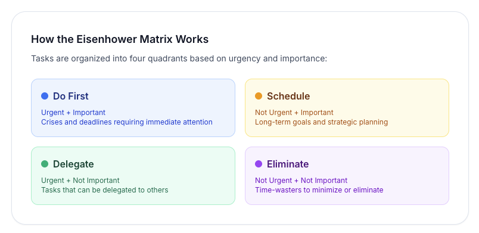

# GSD Task Manager

**Get Stuff Done** (or Get Shit Done, if you're feeling snarky) — A privacy-first task manager based on the Eisenhower Matrix.

Live running app at [gsd.vinny.dev](https://gsd.vinny.dev)

## What is the Eisenhower Matrix?

The Eisenhower Matrix is a productivity framework that helps you prioritize tasks by urgency and importance. It's named after President Dwight D. Eisenhower, who famously said: *"What is important is seldom urgent, and what is urgent is seldom important."*

The matrix divides tasks into four quadrants:

### The Four Quadrants

- **Do First (Urgent + Important)** — Crises, deadlines, emergencies. Handle these immediately.
- **Schedule (Not Urgent + Important)** — Strategic planning, learning, relationship building. This is where you should spend most of your time.
- **Delegate (Urgent + Not Important)** — Interruptions, some emails, other people's priorities. Delegate these when possible.
- **Eliminate (Not Urgent + Not Important)** — Time-wasters, busy work, mindless scrolling. Minimize or eliminate these.

## How GSD Works

GSD Task Manager is a **completely private** task manager that runs entirely in your browser. Your tasks never leave your device — everything is stored locally using IndexedDB.

### Features

✅ **Privacy-first** — All data stays on your device
✅ **Works offline** — Install as a PWA (Progressive Web App)
✅ **Eisenhower Matrix** — Organize tasks by urgency and importance
✅ **Dashboard & Analytics** — Visualize productivity patterns and task metrics
✅ **Batch Operations** — Select and manage multiple tasks at once
✅ **Task Dependencies** — Define which tasks must be completed before others
✅ **Recurring Tasks** — Automatically recreate tasks on a schedule
✅ **Tags & Labels** — Categorize tasks with custom tags
✅ **Subtasks & Checklists** — Break down complex tasks into steps
✅ **Smart Notifications** — Get reminders before tasks are due
✅ **Export/Import** — Back up your tasks as JSON with merge or replace modes
✅ **Keyboard shortcuts** — Fast task entry and navigation
✅ **Dark mode** — Easy on the eyes

## How to Use

### Creating Tasks

1. Click **"New Task"** or press `n`
2. Enter a task title
3. Optionally add a description
4. Mark the task as **Urgent** and/or **Important**
5. Click **"Add Task"**

Your task will automatically appear in the correct quadrant based on your selections.

### Managing Tasks

- **Complete a task** — Click the checkmark icon
- **Edit a task** — Click the edit icon (pencil)
- **Delete a task** — Click the delete icon (trash)
- **Move between quadrants** — Drag and drop tasks, or edit to change urgency/importance

### Dashboard & Analytics

View your productivity metrics and patterns by switching to **Dashboard** view (toggle in header):

- **Task Overview** — Total, active, and completed task counts
- **Completion Rate** — Percentage of tasks completed
- **Quadrant Distribution** — See where your tasks are concentrated
- **7-Day Trend** — Visualize task completion over the past week
- **Due Date Analysis** — Track overdue and upcoming tasks
- **Activity Heatmap** — Identify your most productive days of the week

Use these insights to:
- Identify bottlenecks (too many tasks in Q1? You might be reactive instead of proactive)
- Validate focus (Q2 should be where you spend most time)
- Spot patterns (completing more tasks on certain days?)

### Batch Operations

Select and manage multiple tasks at once:

1. Click **"Select Tasks"** button in the header to enter selection mode
2. Click checkboxes on task cards to select multiple tasks
3. Use the floating action bar at the bottom to:
   - **Complete selected** — Mark all as done
   - **Reopen selected** — Mark completed tasks as active
   - **Delete selected** — Remove multiple tasks at once
   - **Move to quadrant** — Change urgency/importance for all selected
   - **Add tags** — Apply tags to multiple tasks
   - **Assign dependencies** — Set up blocking relationships

This is especially useful for:
- Weekly reviews (bulk moving tasks between quadrants)
- Cleaning up old tasks (bulk delete completed items)
- Organizing projects (bulk tagging related tasks)

### Task Dependencies

Define relationships between tasks where one must be completed before another:

1. When creating or editing a task, use the **Dependencies** section
2. Search for tasks to add as dependencies (tasks that must be completed first)
3. Selected dependencies appear as chips with remove buttons
4. The system prevents circular dependencies (A depends on B, B depends on A)

**Why use dependencies?**
- Break down large projects into ordered steps
- Ensure prerequisite work is done before starting next phase
- Visualize task relationships and blockers

**Example:** "Deploy to production" depends on "Run tests" and "Code review approved"

### Recurring Tasks

Automatically recreate tasks on a schedule:

1. When creating or editing a task, set **Recurrence** to Daily, Weekly, or Monthly
2. When you mark the task complete, a new instance is automatically created with the next due date
3. Subtasks reset to uncompleted in the new instance
4. Recurring tasks show a repeat icon (⟳) on the task card

**Use cases:**
- Daily standup prep
- Weekly status reports
- Monthly expense reviews

### Tags, Subtasks & Notifications

**Tags** — Categorize tasks with custom labels:
- Add tags like `#work`, `#personal`, `#health` in the task form
- Tags appear as colored chips on task cards
- Use search to filter by tag

**Subtasks** — Break complex tasks into steps:
- Add checklist items in the task form
- Toggle subtask completion independently
- Progress bar shows completion (e.g., 2/5)

**Notifications** — Get reminded before tasks are due:
- When setting a due date, choose when to be notified (5 mins, 15 mins, 1 hour, 1 day before)
- Enable/disable notifications per task with the checkbox
- Grant browser notification permissions when prompted

### Keyboard Shortcuts

- `n` — Create a new task
- `/` — Focus the search bar
- `?` — Show help dialog

### Backing Up Your Data

Since all your tasks are stored locally in your browser:

1. Click the **Settings** icon in the header
2. Click **"Export Tasks"** to download a JSON backup
3. Click **"Import Tasks"** to restore from a backup file

When importing, you'll choose between two modes:
- **Merge** — Keep existing tasks and add imported tasks (safer, prevents data loss)
- **Replace** — Delete all existing tasks and replace with imported tasks (shows warning)

**Important:** Clearing your browser data will delete your tasks. Export regularly to avoid data loss!

### Installing as a PWA

GSD can be installed on your desktop or mobile device for offline access:

- **Desktop (Chrome/Edge):** Click the install icon in the address bar
- **Mobile (iOS Safari):** Tap Share → "Add to Home Screen"
- **Mobile (Android Chrome):** Tap the three-dot menu → "Install app"

Visit the [Install page](https://gsd.vinny.dev/install.html) for detailed instructions.

## Tips for Success

### Getting Things Done with GSD

1. **Start your day in Quadrant 2** — Focus on important, non-urgent tasks before firefighting begins
2. **Review weekly** — Use batch operations to move tasks between quadrants as priorities shift
3. **Be honest about urgency** — Not everything is urgent, even if it feels that way
4. **Eliminate ruthlessly** — If a task stays in Q4 for weeks, delete it
5. **Export regularly** — Keep backups of your task data

### Making the Most of v3.0 Features

6. **Check the dashboard weekly** — Review your completion rate and quadrant distribution to identify patterns
7. **Use dependencies for projects** — Break down large initiatives into sequential tasks with clear prerequisites
8. **Batch organize during reviews** — Use selection mode to bulk tag, move, or clean up tasks
9. **Tag strategically** — Use consistent tags like `#work`, `#personal`, `#waiting` to enable filtering
10. **Set recurring tasks for routines** — Weekly reviews, daily planning sessions, monthly goal check-ins
11. **Break down complex tasks** — Use subtasks to make large tasks less intimidating and more actionable
12. **Let notifications help** — Set reminders for time-sensitive tasks, but don't rely on them exclusively

---

For developers interested in contributing or self-hosting, see [TECHNICAL.md](./TECHNICAL.md).
