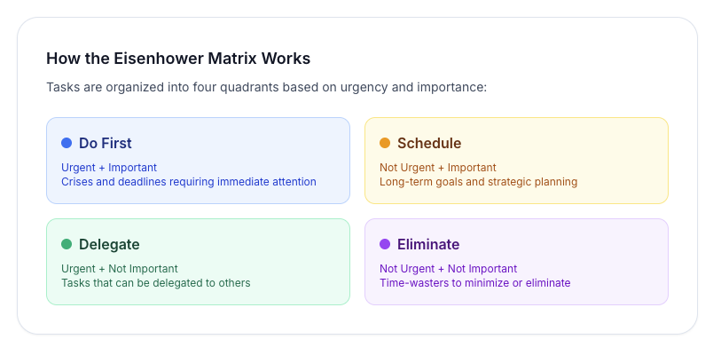

# GSD Task Manager

**Get Stuff Done** (or Get Shit Done, if you're feeling snarky) — A privacy-first task manager based on the Eisenhower Matrix.

**🚀 Live App:** [gsd.vinny.dev](https://gsd.vinny.dev)
**📦 Current Version:** 7.8.1
**🔄 Latest:** Docker self-hosting, TanStack integration, Eisenhower launch screen, UX polish

[](https://www.npmjs.com/package/gsd-mcp-server)
[](https://www.npmjs.com/package/gsd-mcp-server)
[](https://opensource.org/licenses/MIT)

## What is the Eisenhower Matrix?

The Eisenhower Matrix is a productivity framework that helps you prioritize tasks by urgency and importance. It's named after President Dwight D. Eisenhower, who famously said: *"What is important is seldom urgent, and what is urgent is seldom important."*

The matrix divides tasks into four quadrants:



### The Four Quadrants

- **Do First (Urgent + Important)** — Crises, deadlines, emergencies. Handle these immediately.
- **Schedule (Not Urgent + Important)** — Strategic planning, learning, relationship building. This is where you should spend most of your time.
- **Delegate (Urgent + Not Important)** — Interruptions, some emails, other people's priorities. Delegate these when possible.
- **Eliminate (Not Urgent + Not Important)** — Time-wasters, busy work, mindless scrolling. Minimize or eliminate these.

## How GSD Works

GSD Task Manager is a **completely private** task manager that runs entirely in your browser. Your tasks never leave your device — everything is stored locally using IndexedDB.

### Core Features

#### 📊 **Task Management**

- ✅ **Eisenhower Matrix** — Organize tasks by urgency and importance across four quadrants
- ✅ **Task Dependencies** — Define blocking relationships between tasks with circular dependency prevention
- ✅ **Recurring Tasks** — Automatically recreate tasks on daily, weekly, or monthly schedules
- ✅ **Tags & Labels** — Categorize tasks with custom tags for easy filtering
- ✅ **Subtasks & Checklists** — Break down complex tasks into manageable steps with progress tracking
- ✅ **Batch Operations** — Select and manage multiple tasks at once (complete, move, tag, delete)
- ✅ **Smart Search** — Search across titles, descriptions, tags, and subtasks

#### 📈 **Analytics & Insights**

- ✅ **Dashboard View** — Visualize productivity patterns with interactive charts
- ✅ **Completion Metrics** — Track daily, weekly, and monthly completion rates
- ✅ **Streak Tracking** — Monitor current and longest completion streaks
- ✅ **Quadrant Distribution** — Analyze where your time and energy is focused
- ✅ **Tag Analytics** — View completion rates and usage statistics per tag
- ✅ **Trend Analysis** — 7/30/90-day trend views with line and bar charts

#### 🔐 **Privacy & Data**

- ✅ **Privacy-first** — All data stored locally in IndexedDB (no server by default)
- ✅ **Optional Cloud Sync** — Multi-device sync via self-hosted PocketBase with Google/GitHub OAuth
- ✅ **Export/Import** — Back up tasks as JSON with merge or replace modes
- ✅ **Works Offline** — Full functionality without internet connection

#### 📱 **PWA & Notifications**

- ✅ **Install as PWA** — Works on desktop and mobile with offline support
- ✅ **Smart Notifications** — Configurable reminders (5min to 1 day before due)
- ✅ **Auto-Updates** — Service worker updates with user-friendly notifications
- ✅ **Periodic Sync** — Background sync for installed PWAs (Chrome/Edge)

#### 🎨 **User Experience**

- ✅ **Dark Mode** — Automatic theme switching with system preference support
- ✅ **Command Palette** — Universal search and action interface with ⌘K / Ctrl+K shortcut
- ✅ **Quick Settings Panel** — Slide-out panel for frequently-adjusted preferences (theme, notifications, sync interval)
- ✅ **Smart View Pinning** — Pin up to 5 smart views to header with keyboard shortcuts (1-9, 0 to clear)
- ✅ **Keyboard Shortcuts** — Fast navigation (`n` for new task, `⌘K` for command palette, `?` for help)
- ✅ **Drag & Drop** — Reorder tasks and move between quadrants
- ✅ **Responsive Design** — Optimized for desktop, tablet, and mobile

## How to Use

### Creating Tasks

1. Click **"New Task"** or press `n`
2. Enter a task title
3. Optionally add a description
4. Mark the task as **Urgent** and/or **Important**
5. Click **"Add Task"**

Your task will automatically appear in the correct quadrant based on your selections.

### Managing Tasks

- **Complete a task** — Click the checkmark icon
- **Edit a task** — Click the edit icon (pencil)
- **Delete a task** — Click the delete icon (trash)
- **Move between quadrants** — Drag and drop tasks, or edit to change urgency/importance

### Dashboard & Analytics

View your productivity metrics and patterns by switching to **Dashboard** view (toggle in header):

- **Task Overview** — Total, active, and completed task counts
- **Completion Rate** — Percentage of tasks completed
- **Quadrant Distribution** — See where your tasks are concentrated
- **7-Day Trend** — Visualize task completion over the past week
- **Due Date Analysis** — Track overdue and upcoming tasks
- **Activity Heatmap** — Identify your most productive days of the week

Use these insights to:
- Identify bottlenecks (too many tasks in Q1? You might be reactive instead of proactive)
- Validate focus (Q2 should be where you spend most time)
- Spot patterns (completing more tasks on certain days?)

### Batch Operations

Select and manage multiple tasks at once:

1. Click **"Select Tasks"** button in the header to enter selection mode
2. Click checkboxes on task cards to select multiple tasks
3. Use the floating action bar at the bottom to:
   - **Complete selected** — Mark all as done
   - **Reopen selected** — Mark completed tasks as active
   - **Delete selected** — Remove multiple tasks at once
   - **Move to quadrant** — Change urgency/importance for all selected
   - **Add tags** — Apply tags to multiple tasks
   - **Assign dependencies** — Set up blocking relationships

This is especially useful for:
- Weekly reviews (bulk moving tasks between quadrants)
- Cleaning up old tasks (bulk delete completed items)
- Organizing projects (bulk tagging related tasks)

### Task Dependencies

Define relationships between tasks where one must be completed before another:

1. When creating or editing a task, use the **Dependencies** section
2. Search for tasks to add as dependencies (tasks that must be completed first)
3. Selected dependencies appear as chips with remove buttons
4. The system prevents circular dependencies (A depends on B, B depends on A)

**Why use dependencies?**
- Break down large projects into ordered steps
- Ensure prerequisite work is done before starting next phase
- Visualize task relationships and blockers

**Example:** "Deploy to production" depends on "Run tests" and "Code review approved"

### Recurring Tasks

Automatically recreate tasks on a schedule:

1. When creating or editing a task, set **Recurrence** to Daily, Weekly, or Monthly
2. When you mark the task complete, a new instance is automatically created with the next due date
3. Subtasks reset to uncompleted in the new instance
4. Recurring tasks show a repeat icon (⟳) on the task card

**Use cases:**
- Daily standup prep
- Weekly status reports
- Monthly expense reviews

### Tags, Subtasks & Notifications

**Tags** — Categorize tasks with custom labels:
- Add tags like `#work`, `#personal`, `#health` in the task form
- Tags appear as colored chips on task cards
- Use search to filter by tag

**Subtasks** — Break complex tasks into steps:
- Add checklist items in the task form
- Toggle subtask completion independently
- Progress bar shows completion (e.g., 2/5)

**Notifications** — Get reminded before tasks are due:
- When setting a due date, choose when to be notified (5 mins, 15 mins, 1 hour, 1 day before)
- Enable/disable notifications per task with the checkbox
- Grant browser notification permissions when prompted

### Keyboard Shortcuts

**Global Shortcuts:**
- `⌘K` / `Ctrl+K` — Open command palette (universal search and actions)
- `n` — Create a new task
- `/` — Focus the search bar
- `?` — Show help dialog

**Smart View Shortcuts:**
- `1-9` — Activate pinned smart view at that position
- `0` — Clear active smart view filter

**Command Palette Shortcuts:**
- `⌘M` / `Ctrl+M` — View matrix
- `⌘D` / `Ctrl+D` — View dashboard
- `⌘T` / `Ctrl+T` — Toggle theme
- `⌘,` / `Ctrl+,` — Open settings

Use the command palette (⌘K) to discover all available shortcuts and actions!

### Backing Up Your Data

Since all your tasks are stored locally in your browser:

1. Click the **Settings** icon in the header
2. Click **"Export Tasks"** to download a JSON backup
3. Click **"Import Tasks"** to restore from a backup file

When importing, you'll choose between two modes:
- **Merge** — Keep existing tasks and add imported tasks (safer, prevents data loss)
- **Replace** — Delete all existing tasks and replace with imported tasks (shows warning)

**Important:** Clearing your browser data will delete your tasks. Export regularly to avoid data loss!

### Installing as a PWA

GSD can be installed on your desktop or mobile device for offline access:

- **Desktop (Chrome/Edge):** Click the install icon in the address bar
- **Mobile (iOS Safari):** Tap Share → "Add to Home Screen"
- **Mobile (Android Chrome):** Tap the three-dot menu → "Install app"

Visit the [Install page](https://gsd.vinny.dev/install.html) for detailed instructions.

## Tips for Success

### Getting Things Done with GSD

1. **Start your day in Quadrant 2** — Focus on important, non-urgent tasks before firefighting begins
2. **Review weekly** — Use batch operations to move tasks between quadrants as priorities shift
3. **Be honest about urgency** — Not everything is urgent, even if it feels that way
4. **Eliminate ruthlessly** — If a task stays in Q4 for weeks, delete it
5. **Export regularly** — Keep backups of your task data

### Power User Tips

6. **Check the dashboard weekly** — Review your completion rate and quadrant distribution to identify patterns
7. **Use dependencies for projects** — Break down large initiatives into sequential tasks with clear prerequisites
8. **Batch organize during reviews** — Use selection mode to bulk tag, move, or clean up tasks
9. **Tag strategically** — Use consistent tags like `#work`, `#personal`, `#waiting` to enable filtering
10. **Set recurring tasks for routines** — Weekly reviews, daily planning sessions, monthly goal check-ins
11. **Break down complex tasks** — Use subtasks to make large tasks less intimidating and more actionable
12. **Let notifications help** — Set reminders for time-sensitive tasks, but don't rely on them exclusively

---

## 🔧 Backend & Infrastructure (Optional)

GSD Task Manager works completely offline by default, but includes an **optional cloud sync backend** powered by a self-hosted PocketBase instance.

### Cloud Sync Features

The backend provides optional cloud sync via PocketBase at `https://api.vinny.io`:
- **PocketBase Backend** — Self-hosted on AWS EC2, user owns the server and data
- **OAuth Authentication** — Secure login with Google or GitHub via PocketBase built-in auth
- **Multi-Device Sync** — Keep tasks in sync across devices with last-write-wins (LWW) resolution
- **Realtime Updates** — PocketBase SSE (Server-Sent Events) for instant cross-device sync
- **Device Management** — Manage and revoke access for specific devices
- **MCP Server Integration** — AI-powered task management through Claude Desktop (see below)

### CloudFront Edge Routing

The production deployment uses a **CloudFront Function** for intelligent URL routing at edge locations:

**Purpose**: Next.js static exports with `trailingSlash: true` create files like `/dashboard/index.html`, but S3 bucket endpoints don't automatically serve `index.html` for directory paths. Without URL rewriting, navigating to `/dashboard/` would return a 403 error.

**Solution**: A CloudFront Function runs on every request with sub-millisecond latency to rewrite URLs before they reach S3:
- `/dashboard/` → `/dashboard/index.html` ✅
- `/install/` → `/install/index.html` ✅
- `/` → `/index.html` ✅

**Files**:
- `cloudfront-function-url-rewrite.js` - Edge function code (JavaScript runtime)
- `scripts/deploy-cloudfront-function.sh` - Automated deployment script

**Deployment**:
```bash
# Deploy or update the CloudFront Function
./scripts/deploy-cloudfront-function.sh
```

This creates the function, publishes it, attaches it to the CloudFront distribution, and invalidates the cache. Changes propagate to all edge locations within 2-3 minutes.

**Why CloudFront Functions?**
- Runs at CloudFront edge (sub-ms latency, closer to users than Lambda@Edge)
- Lightweight JavaScript runtime (no Node.js overhead)
- Processes 100% of viewer requests before reaching origin (S3)
- Cost-effective at scale (charged per million requests)

### Docker Self-Hosted Deployment

Run the entire GSD stack (static site + PocketBase backend) in a single Docker container using Caddy as the HTTPS reverse proxy:

```bash
# Clone and build
cd docker
docker compose up -d

# Access at https://localhost
```

**What's included:**
- **Multi-stage build** — Bun builds the static Next.js export, then Caddy + PocketBase serve it
- **Automatic HTTPS** — Caddy handles TLS certificates (self-signed for localhost, Let's Encrypt for custom domains)
- **PocketBase bundled** — No separate database server needed; data persists in a Docker volume
- **Non-root container** — Runs as unprivileged user for security

**Custom domain with Let's Encrypt:**
```yaml
environment:
  - SITE_ADDRESS=gsd.example.com
```

See `docker/` directory for `Dockerfile`, `docker-compose.yml`, `Caddyfile`, and entrypoint script.

### MCP Server for AI-Powered Task Management

**📦 npm Package:** [gsd-mcp-server](https://www.npmjs.com/package/gsd-mcp-server)
[](https://www.npmjs.com/package/gsd-mcp-server) [](https://www.npmjs.com/package/gsd-mcp-server)

The **Model Context Protocol (MCP) Server** enables AI assistants like Claude or ChatGPT to manage your tasks through natural language.

**What is MCP?**
- MCP is Anthropic's protocol for connecting AI assistants to external data sources
- The GSD MCP Server runs locally on your machine and communicates with Claude, ChatGPT, or any MCP-compatible AI tool
- Provides full CRUD access to your synced tasks with dry-run safety mode

**Features:**
- ✅ **Full CRUD Operations** — Create, read, update, complete, and delete tasks with natural language
- ✅ **Bulk Operations** — Update up to 50 tasks at once with dry-run preview
- ✅ **Productivity Analytics** — Metrics, quadrant analysis, tag analytics, streak tracking
- ✅ **Smart Search & Filtering** — Search across all task content, filter by quadrant, status, or tags
- ✅ **Retry & Caching** — Exponential backoff for transient failures, in-memory TTL cache
- ✅ **Dry-Run Mode** — Preview all write operations before committing
- ✅ **Self-Hosted** — Your PocketBase server stores data; MCP server communicates directly with it

**Available Tools (20):**

| Category | Tools |
|----------|-------|
| **Read** (7) | `list_tasks`, `get_task`, `search_tasks`, `get_sync_status`, `list_devices`, `get_task_stats`, `get_token_status` |
| **Write** (5) | `create_task`, `update_task`, `complete_task`, `delete_task`, `bulk_update_tasks` |
| **Analytics** (5) | `get_productivity_metrics`, `get_quadrant_analysis`, `get_tag_analytics`, `get_upcoming_deadlines`, `get_task_insights` |
| **System** (3) | `validate_config`, `get_help`, `get_cache_stats` |

**Use Cases:**
- **Weekly Planning** — "What are my urgent tasks this week?"
- **Task Creation** — "Add a task to schedule my dentist appointment, tag it #personal"
- **Productivity Analysis** — "Show my quadrant distribution and completion streaks"
- **Smart Prioritization** — "Which tasks should I focus on today?"
- **Bulk Updates** — "Move all overdue #work tasks to Do First quadrant"

**Security:**
- Auth token stored only in local Claude Desktop config
- Tasks stored on your self-hosted PocketBase server (you own the data)
- Dry-run mode available for all write operations
- Opt-in feature (requires explicit configuration)

**Quick Start:**
```bash
npx gsd-mcp-server --setup
```

See [packages/mcp-server/README.md](./packages/mcp-server/README.md) for detailed setup instructions.

### Recent Updates

**v7.x** (Latest) 🎉
- ✅ **Docker Self-Hosting** — Single-container deployment with Caddy + PocketBase (#171)
- ✅ **TanStack Integration** — TanStack Virtual, Query, and Form for improved performance (#168)
- ✅ **Eisenhower Matrix Launch Screen** — Visual onboarding experience (#169)
- ✅ **UX Polish** — Shadows, gradients, micro-interactions, progressive disclosure, button variants (#167, #173, #179)
- ✅ **Tooltip Portals** — Tooltips render via portal to prevent overflow clipping (#178)
- ✅ **Security Hardening** — Patched flatted, undici, path-to-regexp, picomatch vulnerabilities
- ✅ **Non-root Docker** — Container runs as unprivileged user (#172)
- ✅ **Coding Standards** — DRY error handling, reduced nesting, split oversized components (#170, #174, #180)

**v6.9.0**
- ✅ **PocketBase Migration** — Replaced Cloudflare Workers backend with self-hosted PocketBase
- ✅ **Simplified Sync** — Last-write-wins (LWW) replaces vector clocks; SSE for realtime updates
- ✅ **Google + GitHub OAuth** — PocketBase built-in auth replaces custom OIDC
- ✅ **MCP Server Updated** — Uses PocketBase SDK directly, removed encryption layer
- ✅ **~23,700 lines removed** — Deleted worker/, crypto, vector clocks, old sync engine

**v5.10.0**
- ✅ **Command Palette** — Universal ⌘K interface for quick actions, navigation, and task search
- ✅ **Quick Settings Panel** — Slide-out panel for frequently-adjusted settings
- ✅ **Smart View Pinning** — Pin up to 5 smart views to header with keyboard shortcuts (1-9, 0 to clear)

**v5.0.0**
- ✅ **MCP Server** — AI-powered task management with 20 tools (read, write, analytics, system)
- ✅ **OAuth Cloud Sync** — Multi-device sync with Google/GitHub login
- ✅ **Security Hardening** — Comprehensive security audit and fixes

**v3.x**
- ✅ Next.js 16 with Turbopack and React Compiler
- ✅ Dashboard and analytics system
- ✅ Batch operations and task dependencies
- ✅ CloudFront edge routing for static export SPA navigation

**v2.0.0**
- ✅ Recurring tasks, smart views, tags, subtasks, and advanced filtering

---

## 📚 Developer Documentation

For developers interested in contributing, self-hosting, or deploying:

- **[CLAUDE.md](./CLAUDE.md)** — Architecture, database schema, and project context
- **[packages/mcp-server/README.md](./packages/mcp-server/README.md)** — MCP server setup and API reference

### Quick Start for Developers

```bash
# Install dependencies
bun install

# Run development server
bun dev

# Run tests
bun run test

# Type checking
bun typecheck

# Build for production
bun run build
```

### Tech Stack

- **Frontend:** Next.js 16, React 19, TypeScript, Tailwind CSS v4
- **Data Layer:** Dexie (IndexedDB), TanStack Query/Virtual/Form, Zod validation
- **Charts:** Recharts for analytics visualizations
- **Backend (Optional):** Self-hosted PocketBase (SSE realtime, LWW sync)
- **Auth (Optional):** OAuth 2.0 with Google/GitHub via PocketBase
- **Deployment:** S3/CloudFront static hosting or Docker (Caddy + PocketBase)

---

## 🤝 Contributing

Contributions are welcome! Please:
1. Fork the repository
2. Create a feature branch (`git checkout -b feature/amazing-feature`)
3. Commit your changes (`git commit -m 'feat: add amazing feature'`)
4. Push to the branch (`git push origin feature/amazing-feature`)
5. Open a Pull Request

---

[](https://mseep.ai/app/vscarpenter-gsd-task-manager)

---

## 📄 License

MIT License - see [LICENSE](./LICENSE) for details

---

## 🙏 Acknowledgments

- Inspired by the Eisenhower Matrix productivity framework
- Built with [Claude Code](https://claude.com/claude-code)
