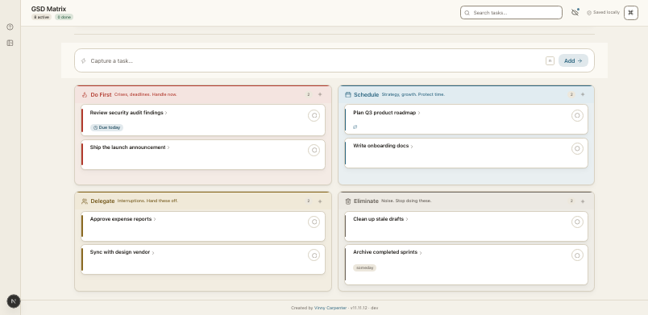

# GSD Task Manager

A privacy-first Eisenhower matrix for deciding what to do, schedule, delegate,
or eliminate.

**Live app:** [gsd.vinny.dev](https://gsd.vinny.dev)
**Current version:** 11.4.0
**Current product:** the v11 single-matrix shell, offline-first local storage,
optional PocketBase sync, and the GSD MCP server.

[](https://www.npmjs.com/package/gsd-mcp-server)
[](https://www.npmjs.com/package/gsd-mcp-server)
[](LICENSE)



## What ships in v11

- A responsive four-quadrant matrix with drag-and-drop movement.
- Quick Capture, full task editing, search, keyboard navigation, and optional
  built-in Smart Views.
- Due dates, tags, dependency selection, and circular-dependency prevention.
- Archive, dashboard/review analytics, sync history, settings, and onboarding.
- Local IndexedDB persistence, JSON import/export, offline PWA support, and
  user-controlled update prompts.
- Optional multi-device PocketBase sync with Google or GitHub OAuth and
  realtime server-sent events.
- A separately installed MCP server with 20 task, analytics, and diagnostic
  tools, including validated and dry-run-aware writes.
- Light and dark Violet Frost themes with WCAG AA as the accessibility floor.

Retired v7/v8 surfaces such as selection-mode batch operations, the Quick
Settings panel, and smart-view pinning shortcuts are not part of the v11 shell.

## Privacy and data custody

Local-only mode is the default. Tasks are stored in the browser's IndexedDB and
the core product does not require a backend. Clearing browser data can erase
local tasks, so export backups regularly.

Cloud sync is explicitly optional. When enabled, task data is sent to the
configured PocketBase server; the hosted configuration uses
`https://api.vinny.io`. Self-hosting instructions and the encryption-at-rest
hooks live under [`docker/`](docker/). See [`SECURITY.md`](SECURITY.md) for the
precise trust and token-storage posture.

## Using the matrix

The Eisenhower matrix classifies work by urgency and importance:

- **Do First** — urgent and important.
- **Schedule** — important, not urgent.
- **Delegate** — urgent, not important.
- **Eliminate** — neither urgent nor important.

Use the Quick Capture field or press `n` to start a task. Use `Shift+N` for the
full composer, `/` for search, `?` for help, and `Option+1` through `Option+4`
(`Alt` on non-Mac keyboards) to focus a quadrant. The in-app help drawer is the
canonical shortcut ledger.

## Local development

Requirements: [Bun](https://bun.sh/) 1.3.14 and a current browser.

```bash
bun install
bun dev
```

Open `http://localhost:3000`. A fresh browser profile starts at `/about`; use
the **Open App** call to action to enter the matrix. PocketBase is not required
for local task CRUD.

### Canonical checks

```bash
bun run test
bun run test -- --coverage
bun typecheck
bun lint
bun run quality:shape
bun run license:check
bun audit --audit-level=high
bun run build
bun run test:e2e
```

Use `bun run test`, not `bun test`; the latter invokes Bun's built-in runner
instead of Vitest. Playwright covers Chromium, Firefox, and WebKit. The optional
authenticated PocketBase harness runs with:

```bash
bun run test:system:pocketbase
```

## Architecture

- Next.js 16 App Router static export; the application is client-side.
- React 19, TypeScript, Tailwind CSS, and the Violet Frost Inkwell tokens.
- Dexie/IndexedDB for local data and PocketBase for optional cloud sync.
- Vitest for unit/integration coverage and Playwright for browser coverage.
- Bun workspaces, including [`packages/mcp-server/`](packages/mcp-server/).

Start with [`ARCHITECTURE.md`](ARCHITECTURE.md),
[`docs/security-trust-boundaries.md`](docs/security-trust-boundaries.md), and
the architecture decisions in [`docs/adr/`](docs/adr/).

## Deployment

- `bun run build` creates the static export in `out/`.
- `bun run deploy:dev` and `bun run deploy` use the repository deployment
  scripts for the configured AWS environments.
- [`docker/Dockerfile`](docker/Dockerfile) builds the self-hosted Caddy and
  PocketBase image.
- [`cloudfront/response-headers-policy.json`](cloudfront/response-headers-policy.json)
  and the related scripts manage production response headers.

Uploading an artifact is not proof that the CDN or a running container serves
it. Verify the deployed URL separately.

## Release documentation checklist

Before changing the release version or announcing a feature:

1. Compare the README version with `package.json`.
2. Verify every feature claim in the current shell, not only in retained data
   models or archived ADRs.
3. Run the canonical checks above and a production static build.
4. Update `CHANGELOG.md`, `SECURITY.md`, and the trust-boundary map when the
   release changes their claims.
5. Treat source, tests, build artifacts, deployment, and live runtime as
   separate evidence states.

## Contributing and security

Read [`CONTRIBUTING.md`](CONTRIBUTING.md) before making changes. Report
vulnerabilities through the private process in [`SECURITY.md`](SECURITY.md),
not a public issue.

## License

[MIT](LICENSE)
