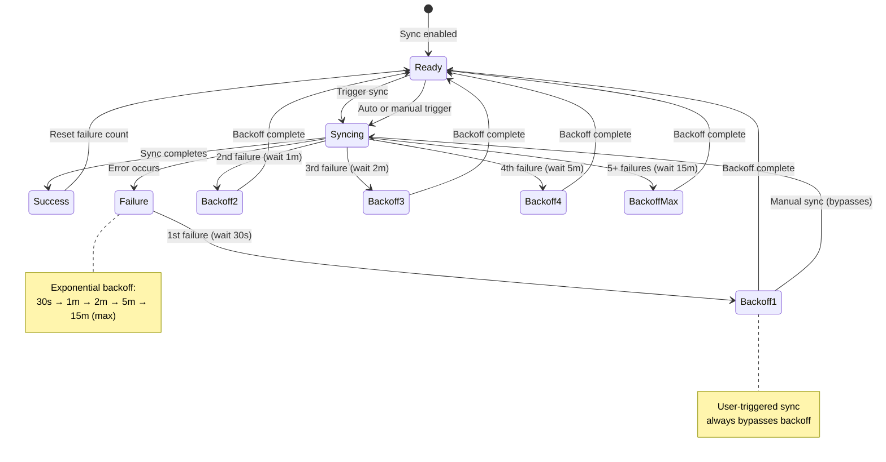
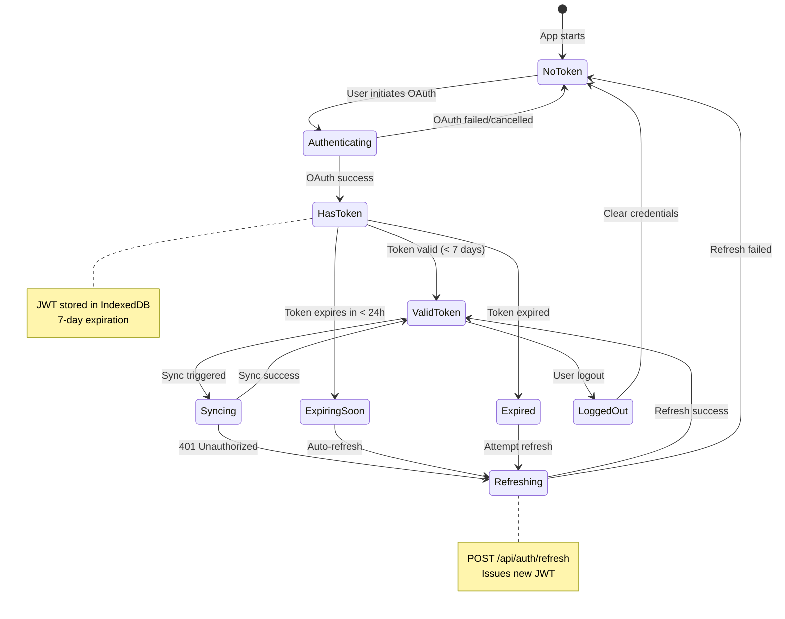
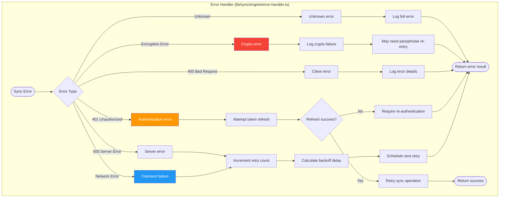

# GSD Task Manager - Sync Architecture

This document provides comprehensive diagrams of the sync engine architecture, including state machines, data flows, and conflict resolution mechanisms.

---

## Overview

The sync system implements a **zero-knowledge architecture** with end-to-end encryption. The server (Cloudflare Worker) stores only encrypted blobs and cannot decrypt task content. Synchronization uses **vector clocks** for distributed conflict detection and resolution.

---

## Sync Engine State Machine

The `SyncEngine` class (`lib/sync/engine/coordinator.ts`) orchestrates sync operations through a 6-phase state machine:

---

## Sync Operation Flow

Detailed sequence diagram showing the complete sync operation:

---

## Push Handler Flow

The push handler encrypts and uploads local changes:

---

## Pull Handler Flow

The pull handler downloads and decrypts remote changes:

---

## Vector Clock Comparison

Vector clocks enable distributed conflict detection without central coordination:

---

## Conflict Resolution Strategies

---

## Queue Optimization

The queue optimizer consolidates redundant operations before sync:

---

## Retry and Backoff Logic

---

## Encryption Flow

---

## Complete Sync Data Flow

End-to-end view of sync across devices:

---

## Token Lifecycle

---

## Error Handling Hierarchy

---

## Related Documentation

- **Database Architecture:** `DATABASE_ARCHITECTURE.md`
- **OAuth/OIDC Guide:** `OAUTH_OIDC_GUIDE.md`
- **Worker Architecture:** `WORKER_ARCHITECTURE.md`
- **MCP Server Architecture:** `MCP_ARCHITECTURE.md`

## Code References

- **Sync Engine:** `lib/sync/engine/coordinator.ts`
- **Push Handler:** `lib/sync/engine/push-handler.ts`
- **Pull Handler:** `lib/sync/engine/pull-handler.ts`
- **Conflict Resolver:** `lib/sync/engine/conflict-resolver.ts`
- **Crypto Manager:** `lib/sync/crypto.ts`
- **Queue Optimizer:** `lib/sync/queue-optimizer.ts`
- **Retry Manager:** `lib/sync/retry-manager.ts`
