# GSD Task Manager - Worker Architecture

This document provides comprehensive diagrams of the Cloudflare Worker backend, including OAuth/OIDC flows, sync handlers, and API structure.

---

## Overview

The backend is built on **Cloudflare Workers** with:
- **Hono Router** (via itty-router) for API routing
- **D1 (SQLite)** for structured data (users, devices, vector clocks)
- **R2** for encrypted blob storage (task data)
- **KV** for session cache and OAuth state

---

## System Architecture

```mermaid
flowchart TB
    subgraph "Clients"
        PWA[PWA Browser]
        MCP[MCP Server<br/>Claude Desktop]
    end

    subgraph "Edge (Cloudflare)"
        CF[CloudFront/CDN]
        WORKER[Cloudflare Worker<br/>Hono Router]

        subgraph "Storage"
            D1[(D1 SQLite<br/>Users, Devices,<br/>Vector Clocks)]
            R2[(R2 Bucket<br/>Encrypted Task Blobs)]
            KV[(Workers KV<br/>Sessions, OAuth State,<br/>Rate Limits)]
        end

        WORKER --> D1
        WORKER --> R2
        WORKER --> KV
    end

    subgraph "OAuth Providers"
        GOOGLE[Google OIDC]
        APPLE[Apple Sign In]
    end

    PWA -->|HTTPS| CF
    MCP -->|HTTPS| CF
    CF --> WORKER

    WORKER <-->|OAuth| GOOGLE
    WORKER <-->|OAuth| APPLE

    style WORKER fill:#FF9800,color:white
    style D1 fill:#2196F3,color:white
    style R2 fill:#4CAF50,color:white
    style KV fill:#9C27B0,color:white
```



---

## API Route Structure

```mermaid
flowchart TD
    subgraph "Worker Router (worker/src/index.ts)"
        ROOT[/] --> HEALTH[GET /health]

        ROOT --> AUTH[/api/auth/*]
        ROOT --> SYNC[/api/sync/*]
        ROOT --> DEVICES[/api/devices/*]
        ROOT --> STATS[GET /api/stats]

        subgraph "OAuth Routes (No Auth)"
            AUTH --> START[GET /api/auth/oauth/:provider/start]
            AUTH --> CALLBACK[POST/GET /api/auth/oauth/callback]
            AUTH --> RESULT[GET /api/auth/oauth/result]
        end

        subgraph "Auth Routes (JWT Required)"
            AUTH --> SALT_GET[GET /api/auth/encryption-salt]
            AUTH --> SALT_POST[POST /api/auth/encryption-salt]
            AUTH --> LOGOUT[POST /api/auth/logout]
            AUTH --> REFRESH[POST /api/auth/refresh]
        end

        subgraph "Sync Routes (JWT + Rate Limit)"
            SYNC --> PUSH[POST /api/sync/push]
            SYNC --> PULL[POST /api/sync/pull]
            SYNC --> RESOLVE[POST /api/sync/resolve]
            SYNC --> STATUS[GET /api/sync/status]
        end

        subgraph "Device Routes (JWT Required)"
            DEVICES --> LIST_DEV[GET /api/devices]
            DEVICES --> REVOKE[DELETE /api/devices/:id]
        end
    end

    style START fill:#4CAF50,color:white
    style CALLBACK fill:#4CAF50,color:white
    style PUSH fill:#2196F3,color:white
    style PULL fill:#2196F3,color:white
```

---

## Middleware Pipeline


---

## OAuth/OIDC Complete Flow

### Desktop Browser Flow (Popup)


### PWA Flow (Full Redirect)


---

## OAuth State Machine


---

## OAuth Handler Modules


---

## Sync Push Handler


---

## Sync Pull Handler


---

## Database Schema (D1)


---

## Rate Limiting Strategy

```mermaid
flowchart TD
    REQ([Request]) --> EXTRACT[Extract client identifier<br/>IP + User-Agent hash]

    EXTRACT --> CHECK[Check KV counter<br/>rate_limit:{identifier}]

    CHECK --> EXISTS{Counter exists?}

    EXISTS -->|No| CREATE[Create counter = 1<br/>TTL = window size]
    EXISTS -->|Yes| INCREMENT[Increment counter]

    CREATE --> PASS[Allow request]
    INCREMENT --> COMPARE{Counter > limit?}

    COMPARE -->|No| PASS
    COMPARE -->|Yes| BLOCK[429 Too Many Requests]

    PASS --> HANDLER[Continue to handler]
    BLOCK --> HEADERS[Set Retry-After header]

    subgraph "Rate Limits"
        direction TB
        OAUTH[OAuth endpoints<br/>10 req/min]
        SYNC_LIMIT[Sync endpoints<br/>60 req/min]
        GENERAL[Other endpoints<br/>100 req/min]
    end

    style BLOCK fill:#F44336,color:white
    style PASS fill:#4CAF50,color:white
```

---

## JWT Token Structure


---

## Session Management


---

## Scheduled Cleanup Job


---

## Error Response Format

```mermaid
flowchart TD
    ERROR([Error Occurs]) --> TYPE{Error Type}

    TYPE -->|Validation| E400[400 Bad Request]
    TYPE -->|Auth| E401[401 Unauthorized]
    TYPE -->|Permission| E403[Forbidden]
    TYPE -->|Not Found| E404[Not Found]
    TYPE -->|Rate Limit| E429[Too Many Requests]
    TYPE -->|Server| E500[Internal Server Error]

    E400 --> FORMAT
    E401 --> FORMAT
    E403 --> FORMAT
    E404 --> FORMAT
    E429 --> FORMAT
    E500 --> FORMAT

    FORMAT[JSON Response]

    subgraph "Response Body"
        BODY["{<br/>  error: string,<br/>  message?: string (dev only),<br/>  stack?: string (dev only)<br/>}"]
    end

    FORMAT --> BODY

    subgraph "Headers"
        CORS_H[Access-Control-Allow-Origin]
        RETRY[Retry-After (429 only)]
    end

    FORMAT --> CORS_H
    E429 --> RETRY
```

---

## Environment Configuration

```mermaid
flowchart LR
    subgraph "Secrets (wrangler.toml)"
        JWT_SECRET[JWT_SECRET]
        GOOGLE_ID[GOOGLE_CLIENT_ID]
        GOOGLE_SEC[GOOGLE_CLIENT_SECRET]
        APPLE_ID[APPLE_CLIENT_ID]
        APPLE_SEC[APPLE_CLIENT_SECRET]
    end

    subgraph "Bindings"
        DB[DB: D1 Database]
        STORAGE[STORAGE: R2 Bucket]
        KV_BIND[KV: KV Namespace]
    end

    subgraph "Variables"
        ENV_VAR[ENVIRONMENT: dev|staging|prod]
        CALLBACK[OAUTH_CALLBACK_BASE]
        REDIRECT[OAUTH_REDIRECT_URI]
    end

    JWT_SECRET --> WORKER
    GOOGLE_ID --> WORKER
    GOOGLE_SEC --> WORKER
    APPLE_ID --> WORKER
    APPLE_SEC --> WORKER

    DB --> WORKER
    STORAGE --> WORKER
    KV_BIND --> WORKER

    ENV_VAR --> WORKER
    CALLBACK --> WORKER
    REDIRECT --> WORKER

    WORKER[Cloudflare Worker]

    style WORKER fill:#FF9800,color:white
```

---

## Related Documentation

- **Sync Architecture:** `SYNC_ARCHITECTURE.md`
- **Database Architecture:** `DATABASE_ARCHITECTURE.md`
- **OAuth/OIDC Guide:** `OAUTH_OIDC_GUIDE.md`
- **MCP Server Architecture:** `MCP_ARCHITECTURE.md`

## Code References

- **Worker Entry:** `worker/src/index.ts`
- **OIDC Handlers:** `worker/src/handlers/oidc/`
- **Sync Handlers:** `worker/src/handlers/sync/`
- **Auth Middleware:** `worker/src/middleware/auth.ts`
- **Rate Limiter:** `worker/src/middleware/rate-limit.ts`
- **JWT Utilities:** `worker/src/utils/jwt.ts`
- **Config:** `worker/src/config.ts`
