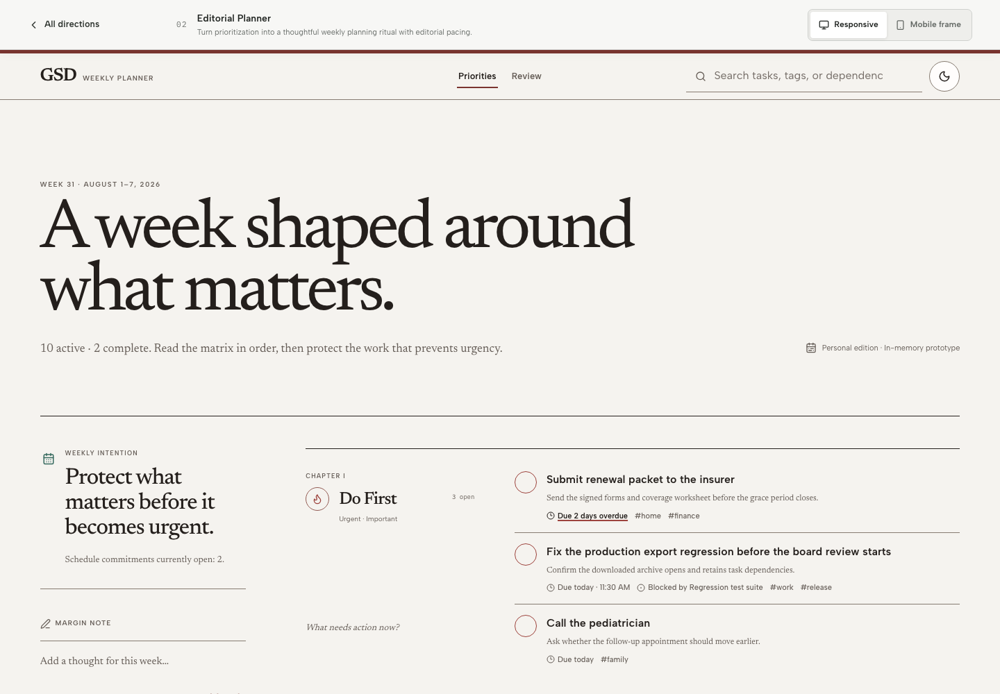
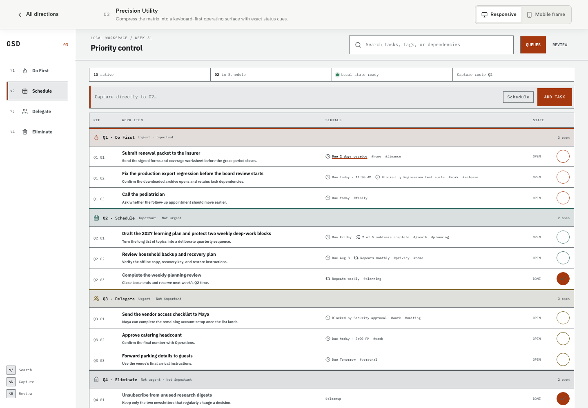
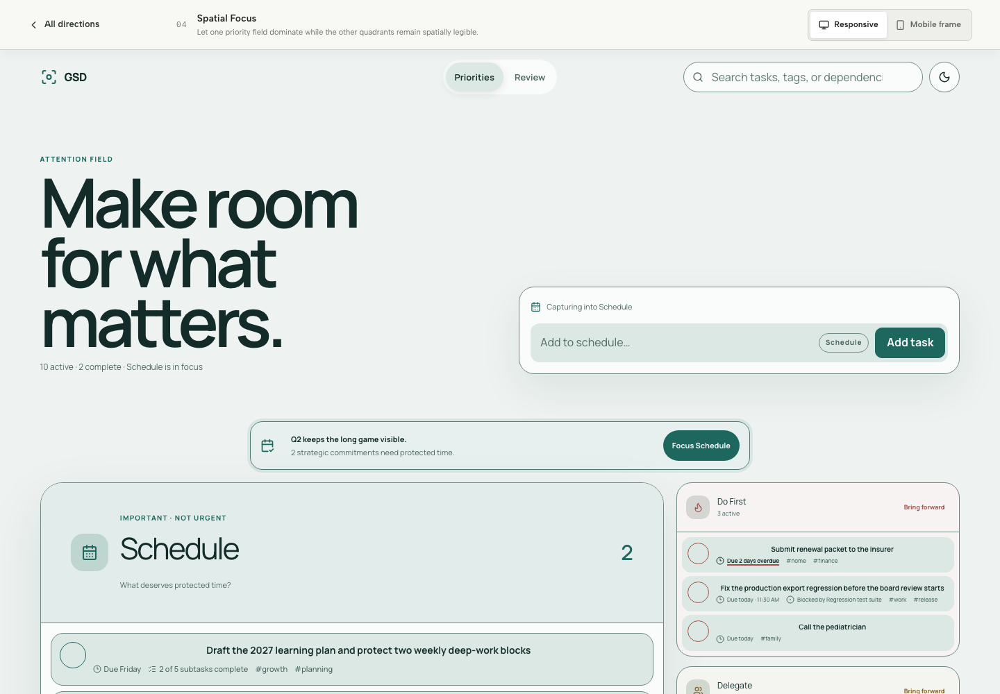
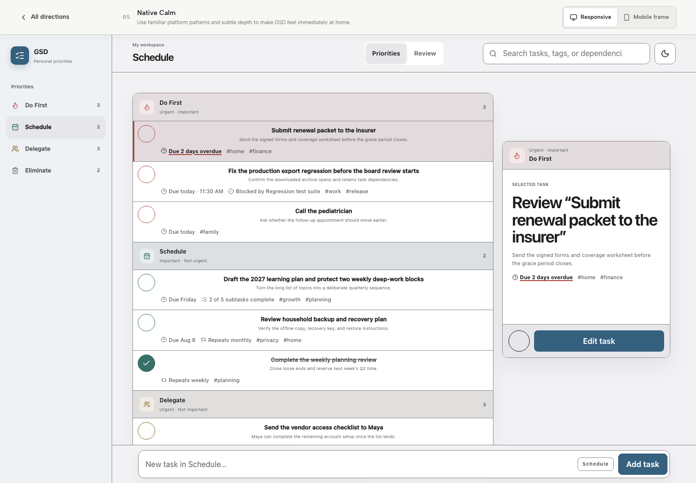

# GSD design directions

**Decision package:** 2026-08-01

**Prototype index:** [http://localhost:3000/design-lab](http://localhost:3000/design-lab)

**Scope:** isolated visual and interaction exploration; no production data,
persistence, synchronization, schema, service-worker, or matrix behavior changes

## How to read this document

The five prototypes intentionally reuse one deterministic set of 12 tasks: three
in each Eisenhower quadrant, with the same long and short titles, due-today and
overdue states, recurrence, tags, subtasks, dependency, and completion state.
That keeps hierarchy and interaction—not content selection—as the variable.

Every prototype also shares a small, in-memory interaction contract:

- Search matches title, description, tags, and dependency, with a recoverable
  no-results state.
- Quick capture adds an unsaved mock task to the active quadrant (Schedule by
  default) and announces the result in a polite live region.
- Completion can be toggled without opening the task.
- A Radix dialog demonstrates editing title and quadrant, keyboard focus
  containment, Escape/Cancel, and focus return to the opener. Notes are visual
  prototype content rather than persisted data.
- Matrix and Review modes, light and dark palettes, responsive and 390 × 844
  preview modes use the same underlying records.
- Lucide quadrant icons, labels, axis descriptions, order, and counts carry
  meaning in addition to color.

The palette contract includes canvas, surface, raised surface, text, muted text,
accent, accent text, focus, divider, and four quadrant colors for both themes.
Automated tests calculate the intended 4.5:1 text and 3:1 focus/divider/control
contrast floors. The final production build reported zero axe violations across
the overview plus all five concepts in light and dark (11 states), while the
targeted interaction suite passed 11/11 in both Chromium and WebKit. The 30
concept screenshots are Chromium artifacts; WebKit evidence is behavioral. These
checks do not substitute for VoiceOver, physical iOS, real-touch, or usability
testing.

---

## 01 — Refined Evolution

**Route:** [http://localhost:3000/design-lab/refined-evolution](http://localhost:3000/design-lab/refined-evolution)

**One-sentence concept:** Make Violet Frost quieter, clearer, and faster without
breaking recognition.

**Emotional character:** Familiar, deliberate, assured.

### Thesis and best fit

Refined Evolution treats the current GSD mental model as an asset. It keeps a
balanced, immediately scannable four-quadrant matrix, familiar Albert Sans, a
restrained violet interaction color, and colored quadrant rules. It spends its
design change budget on clearer hierarchy, quieter metadata, a more prominent
capture seam, and an explicit reminder that Q2 work needs protection.

It best fits an existing GSD user who moves between rapid triage and deliberate
weekly planning, wants zero relearning, and values seeing the whole matrix at
once. It is also the safest baseline against which to judge the more structural
directions.

### Visual system

| Token | Light | Dark |
| --- | --- | --- |
| Canvas / surface / raised | `#F3F3F7` / `#FDFDFF` / `#F7F7FA` | `#14131B` / `#211F2B` / `#191821` |
| Text / muted | `#242331` / `#646477` | `#ECEAF2` / `#AAA6B8` |
| Accent / on-accent / focus | `#5C4F7D` / `#FDFDFF` / `#5C4F7D` | `#A99BCB` / `#14131B` / `#BBAFDA` |
| Divider | `#8D8C9D` | `#6F6B80` |
| Q1 / Q2 / Q3 / Q4 | `#B95F5A` / `#4D7A72` / `#A17D37` / `#7A7D8E` | `#D88C86` / `#83B2A8` / `#D0AF68` / `#A5A7B8` |

- **Typography:** Albert Sans preserves product recognition. Utility and
  metadata sit at 10–13px, pane/task labels at 13–14px, and the introductory
  display scales from 36px to 68px. Tight display tracking gives the familiar
  face more authority without introducing a new brand voice.
- **Spacing and density:** an 8px task rhythm, 16px pane gaps, 16–44px adaptive
  page gutters, and moderate information density. Metadata wraps rather than
  forcing a card wider.
- **Shape and border:** 7–12px radii, one-pixel dividers, a three-pixel quadrant
  rule, and a three-pixel task spine. Pills are reserved for the capture route;
  most shapes remain compact and workmanlike.
- **Elevation:** low-contrast 5–10% shadows separate floating panes and capture
  from the canvas. Depth is supportive, not the organizing principle.
- **Iconography:** one consistent Lucide icon per quadrant, repeated in headers,
  cues, and editing options. Icon + name + axis + location means the pigment is
  redundant rather than required.
- **Motion:** only short state feedback and the shared 150–180ms dialog entrance.
  Reduced-motion preferences collapse animation durations to effectively zero.

### Layout by viewport

- **Desktop:** sticky three-part header; title and Q2 planning cue; full-width
  capture; balanced 2 × 2 floating panes. The whole decision space remains above
  the fold at common desktop heights.
- **Tablet/laptop:** the header stays compact, the Q2 aside yields, and quadrants
  become one column below a 900px prototype width. This favors reading order over
  compressing four undersized panes.
- **Mobile:** a two-row header keeps the view switch, search, and theme control
  reachable; quadrants follow a single Q1→Q4 reading order; review metrics stack.
  A production evolution could test quadrant tabs, but the prototype deliberately
  retains whole-matrix comprehension while scrolling.

### Interaction and state grammar

- **Matrix:** equal pane weight is retained, but Q2 receives a separate strategic
  cue so importance is not drowned out by Q1 urgency.
- **Task card:** wrap-capable title hierarchy, optional signal row, an independent
  completion control that reaches 44px on coarse pointers, quadrant spine, and a muted, struck-through title for
  completion without reducing whole-row opacity. Destructive action remains
  absent from the scanning surface.
- **Capture:** a persistent natural-language bar spans the matrix and shows the
  target quadrant before submission.
- **Editing:** the common centered dialog keeps the production-familiar form
  model and exposes priority as four named radio choices.
- **Search/empty:** a header search filters every quadrant; zero results replace
  the matrix with an explanation and one Clear search action.
- **Review:** three outcome metrics and four color-independent distribution rows
  answer whether strategic work, active load, or overdue work needs attention.

### Accessibility and dark mode

This direction has the most conventional reading order and the least visual/DOM
reordering. Named regions, heading hierarchy, independent complete controls,
visible three-pixel focus outlines, 44px shared controls, and linear mobile
stacking make it resilient to keyboard use, screen readers, and 200% zoom. Dark
mode is tuned with lighter quadrant pigments and aubergine actions rather than a
mechanical inversion.

### Strengths, risks, and simplification

**Strengths:** fastest recognition, lowest migration cost, strong whole-matrix
comprehension, prominent capture, and the clearest bridge from today’s product.

**Risks:** it may feel like polish rather than a decisive new chapter; four equal
panes still imply that all quadrants deserve similar attention; the mobile linear
matrix remains long when task volume grows.

**Intentionally removes or quiets:** decorative washes, repeated status chrome,
and card-level secondary actions. It does not remove the literal four-quadrant
model.

**Implementation complexity:** low. The token, matrix, card, and capture contracts
map closely to current production architecture. **Migration risk:** low, provided
existing drag/drop, capture, and editor behavior remain unchanged beneath the new
presentation.

**Evidence set:** [desktop 1440 × 1000](../../artifacts/design-exploration/01-refined-evolution/01-desktop-matrix.png) · [laptop 1280 × 800](../../artifacts/design-exploration/01-refined-evolution/02-laptop-matrix.png) · [mobile 390 × 844](../../artifacts/design-exploration/01-refined-evolution/03-mobile-matrix.png) · [edit dialog](../../artifacts/design-exploration/01-refined-evolution/04-edit-dialog.png) · [review](../../artifacts/design-exploration/01-refined-evolution/05-review.png) · [dark matrix](../../artifacts/design-exploration/01-refined-evolution/06-dark-matrix.png)

---

## 02 — Editorial Planner

**Route:** [http://localhost:3000/design-lab/editorial-planner](http://localhost:3000/design-lab/editorial-planner)

**One-sentence concept:** Turn prioritization into a thoughtful weekly planning
ritual with editorial pacing.

**Emotional character:** Warm, reflective, grounded.

### Thesis and best fit

Editorial Planner reframes the matrix as a personal weekly publication: a dated
folio, a standing intention in the margin, and four chapters read in sequence.
It asks users to slow down just enough to classify work with care. The direction
rejects a dashboard of interchangeable tiles in favor of typographic pacing,
rules, whitespace, and plain-language prompts.

It best fits a reflective planner who conducts a weekly review, values Q2 time,
and wants GSD to feel closer to a trusted personal daybook than an operations
console. It is less suited to users who spend the entire day in high-volume
triage.

### Visual system

| Token | Light | Dark |
| --- | --- | --- |
| Canvas / surface / raised | `#F5F3EF` / `#FFFDFC` / `#ECE7E1` | `#191614` / `#24201D` / `#302A25` |
| Text / muted | `#241F1C` / `#655D57` | `#F4EFE8` / `#BDB3A8` |
| Accent / on-accent / focus | `#7A342F` / `#FFFDFC` / `#7A342F` | `#D78B7C` / `#231412` / `#E59A89` |
| Divider | `#867B71` | `#756B62` |
| Q1 / Q2 / Q3 / Q4 | `#9D433D` / `#35695E` / `#7E612A` / `#625E67` | `#D78B7C` / `#87B7A8` / `#C8A86A` / `#A9A3AF` |

- **Typography:** Newsreader carries the folio, intention, task title, prompts,
  and reflection; Albert Sans carries controls, labels, and search. Utility type
  runs 9–13px, tasks 19px, chapter headings 25px, and display type 42–108px.
  The pairing distinguishes contemplation from operation without resorting to
  ornament.
- **Spacing and density:** 24–46px chapter intervals, 46–100px column gaps, and
  54–118px opening space create a deliberate reading cadence. Three task rows per
  chapter prevent the generous layout from becoming empty theater.
- **Shape and border:** mostly square, open compositions divided by one-pixel
  rules. Circular quadrant stamps and theme control are rare accents. There are
  no generic rounded cards around every section.
- **Elevation:** nearly flat. Sticky translucent navigation is the only persistent
  layer; hierarchy comes from type, rules, and space.
- **Iconography:** sparse Lucide folio, pen, calendar, and quadrant marks. Roman
  chapter numbers, full quadrant names, axes, and prompts reinforce meaning.
- **Motion:** restrained to shared dialog/state transitions. The concept’s sense
  of progression comes from scroll and reading order, not animated decoration.

### Layout by viewport

- **Desktop:** sticky folio navigation; large dated opening; a sticky intention
  and margin-note capture column; four chapters in the main reading column.
- **Tablet/laptop:** the intention and margin note become a two-column preface;
  chapters collapse to one column with heading/prompt above task rows.
- **Mobile:** the folio, intention, capture, and chapters become a deliberate
  single-column daybook. Large type remains expressive but is capped at 51px.
  The view switch remains reachable in the compact header above search, so
  Matrix and Review do not depend on a desktop-only control. Capture stays in
  the editorial preface rather than becoming a sticky footer.

### Interaction and state grammar

- **Matrix:** the quadrants become Chapters I–IV in canonical order. Each chapter
  pairs the formal axis with a humane question, making classification more
  teachable without onboarding copy.
- **Task card:** open list rows foreground title and description, followed by a
  quiet metadata line. Completion is an independent circular action; only the
  done title mutes and strikes through.
- **Capture:** a margin-note composer adds to Schedule and explains that routing
  in adjacent microcopy. Capture is intentionally present but subordinate to the
  weekly intention.
- **Editing:** the shared dialog creates a clear operational break from the
  publication-like reading surface.
- **Search/empty:** an understated rule-based header search filters all chapters;
  chapter-level empty copy and the shared global recovery distinguish a clear
  chapter from a query with no result.
- **Review:** a reflection spread combines completed-work evidence, a Q2-oriented
  maxim, and three quadrant questions instead of KPI tiles.

### Accessibility and dark mode

Semantic sections, ordered chapters, descriptive prompts, full task descriptions,
and redundant quadrant cues support comprehension. The generous line height and
linear responsive flow are zoom-friendly. Risks are the wide type-size contrast,
small uppercase utility text, and the amount of scrolling between capture and
later chapters. Dark mode behaves like ink on warm charcoal rather than
reversing to a blue-black application shell; coral, green, ochre, and lilac
quadrant pigments remain independently tuned.

### Strengths, risks, and simplification

**Strengths:** strongest emotional distinction, best weekly-planning voice,
excellent Q2 framing, low decorative noise, and the most humane explanation of
the matrix for a first-time user.

**Risks:** slower scanning, large vertical footprint, capture can scroll away on
small screens, and the serif-heavy treatment may feel ceremonial during a busy
day. The compact header retains all essential controls but consumes two rows once
search joins the view switch.

**Intentionally removes or quiets:** permanent 2 × 2 geometry, dashboard-card
chrome, dense metadata, and always-visible secondary operations.

**Implementation complexity:** medium-high. It introduces a new typographic
system, chapter IA, review language, and substantially different responsive
composition. **Migration risk:** medium; underlying task behavior can stay, but
experienced users must relearn spatial scanning and rapid quadrant comparison.

**Evidence set:** [desktop 1440 × 1000](../../artifacts/design-exploration/02-editorial-planner/01-desktop-matrix.png) · [laptop 1280 × 800](../../artifacts/design-exploration/02-editorial-planner/02-laptop-matrix.png) · [mobile 390 × 844](../../artifacts/design-exploration/02-editorial-planner/03-mobile-matrix.png) · [edit dialog](../../artifacts/design-exploration/02-editorial-planner/04-edit-dialog.png) · [review](../../artifacts/design-exploration/02-editorial-planner/05-review.png) · [dark matrix](../../artifacts/design-exploration/02-editorial-planner/06-dark-matrix.png)

---

## 03 — Precision Utility

**Route:** [http://localhost:3000/design-lab/precision-utility](http://localhost:3000/design-lab/precision-utility)

**One-sentence concept:** Compress the matrix into a keyboard-first operating
surface with exact status cues.

**Emotional character:** Crisp, direct, disciplined.

### Thesis and best fit

Precision Utility treats prioritization as routing work through four named
queues. It replaces soft panes and card stacks with a command rail, compact
status strip, semantic tables, reference numbers, explicit state, and a shortcut
ledger. A safety-orange accent carries action while the foundation remains
neutral.

It best fits an experienced, keyboard-oriented user with many active tasks who
values density and exact status over atmosphere. It tests how far GSD can move
toward operational speed without becoming an enterprise project tool.

### Visual system

| Token | Light | Dark |
| --- | --- | --- |
| Canvas / surface / raised | `#F2F3F3` / `#FFFFFF` / `#E7E9EA` | `#101213` / `#181B1D` / `#24282A` |
| Text / muted | `#171A1C` / `#51585C` | `#F2F4F5` / `#B2B7BA` |
| Accent / on-accent / focus | `#A6380F` / `#FFFFFF` / `#A6380F` | `#FF8A5B` / `#211007` / `#FF9D77` |
| Divider | `#71787B` | `#697074` |
| Q1 / Q2 / Q3 / Q4 | `#A6380F` / `#2D665D` / `#765B18` / `#565D61` | `#FF8A5B` / `#73B7A8` / `#D1B15A` / `#A8B0B4` |

- **Typography:** IBM Plex Sans provides a compact, legible workface; IBM Plex
  Mono distinguishes references, status, shortcuts, and data. Dense table labels
  use 8–10px, work items and controls 10–11px, section labels 17–19px, and review
  headings 26–40px.
- **Spacing and density:** 1–10px table seams, 8–16px row/control padding, and a
  narrow 184px rail create the highest density of the five directions.
- **Shape and border:** square utility controls, circular completion controls,
  zero-radius tables, one-pixel grid lines, and three-pixel active/accent rules. The absence of soft containers makes
  grouping explicit and measurable.
- **Elevation:** flat on desktop. Only the mobile command rail floats, where
  elevation communicates that it is persistent navigation.
- **Iconography:** small Lucide quadrant symbols appear beside full names and
  numbered keys. Monospaced `Q1.01` references and Open/Done labels carry state
  independently of color.
- **Motion:** almost none. Shortcut focus and state changes are immediate; the
  shared editor respects reduced motion.

### Layout by viewport

- **Desktop:** sticky command rail; sticky workspace header; status strip;
  command-like capture; four table rowgroups in one shared grid.
- **Narrow workspace (≤820px):** the command rail becomes a four-destination
  floating bottom control. Review metrics collapse from four columns to two.
- **Mobile:** search and the view switch share the header, status wraps, capture
  becomes two rows, and the dense table becomes a semantic three-column queue:
  Work item, Signals, and State. Reference IDs yield while descriptions and all
  task signals wrap within their cells instead of forcing horizontal inspection;
  the workspace heading remains visible and the theme control stays in the
  floating command rail.

### Interaction and state grammar

- **Matrix:** four semantic table bodies provide shared Ref, Work item, Signals,
  and State columns. Each queue has a named heading, axis, icon, colored rule,
  and open count.
- **Task card:** cards become rows. Title and description occupy the work-item
  column; due/recurrence/subtask/dependency/tag signals align in one column;
  completion and Open/Done align in another. Completed rows retain full-surface
  contrast while muting and striking the title rather than fading the entire row.
- **Capture:** the bar shows the active `Q1`–`Q4` route before submission. Keys
  `⌥1`–`⌥4` change that route, `⌥/` focuses search, `⌥N` focuses capture, and
  `⌥R` opens Review. Requiring Option prevents unmodified typing from colliding
  with global commands; shortcuts also ignore form fields and other modifiers.
- **Editing:** the shared dialog prevents dense inline editing from destabilizing
  columns.
- **Search/empty:** search is globally available and keyboard-addressable; an
  explicit no-results state replaces an empty table.
- **Review:** four operator metrics precede a ranked active queue ordered by
  quadrant and then due state.

### Accessibility and dark mode

This is the strongest semantic data model: real table headings, row headers,
rowgroups, captions, named navigation, pressed state, status text, and visible
keyboard orientation. Its largest accessibility risk is visual rather than
semantic: 8–11px desktop utility text and dense lines can burden low-vision,
motor, and cognitive users even when contrast passes. The compact mobile table
removes horizontal inspection, preserves native row/column relationships and the
workspace heading/theme control, retains task information, and avoids whole-row
opacity for completed work. A production version should still raise the minimum
text step and offer comfortable density. Dark mode keeps the graphite grid while raising
orange and teal luminance.

### Strengths, risks, and simplification

**Strengths:** fastest expert routing, best keyboard model, most exact state
grammar, highest information density, and excellent at-a-glance workload
comparison on desktop.

**Risks:** can feel colder and more enterprise-like than GSD’s intended personal
character; tiny desktop utility type reduces resilience; the compact mobile table
creates tall, narrow rows to retain descriptions and signals while hiding reference
IDs; Option-based
shortcut chrome add learning cost.

**Intentionally removes or quiets:** soft cards, decorative elevation, prose
prompts, oversized headings, and duplicated metadata presentation.

**Implementation complexity:** medium-high. Semantic queue rendering is
straightforward, but production-grade keyboard arbitration, drag/drop within a
responsive table, virtualized density, signal disclosure, and user-configurable
density increase work. **Migration risk:** medium; the data model remains intact,
while scanning and manipulation patterns change substantially.

**Evidence set:** [desktop 1440 × 1000](../../artifacts/design-exploration/03-precision-utility/01-desktop-matrix.png) · [laptop 1280 × 800](../../artifacts/design-exploration/03-precision-utility/02-laptop-matrix.png) · [mobile 390 × 844](../../artifacts/design-exploration/03-precision-utility/03-mobile-matrix.png) · [edit dialog](../../artifacts/design-exploration/03-precision-utility/04-edit-dialog.png) · [review](../../artifacts/design-exploration/03-precision-utility/05-review.png) · [dark matrix](../../artifacts/design-exploration/03-precision-utility/06-dark-matrix.png)

---

## 04 — Spatial Focus

**Route:** [http://localhost:3000/design-lab/spatial-focus](http://localhost:3000/design-lab/spatial-focus)

**One-sentence concept:** Let one priority field dominate while the other
quadrants remain spatially legible.

**Emotional character:** Immersive, calm, intentional.

### Thesis and best fit

Spatial Focus challenges the permanent four-equal-pane assumption. The active
quadrant becomes a large work field; the other three remain as orbiting summaries
that can be brought forward. Schedule is the default focus and receives a
persistent Q2 cue, so urgent work no longer wins merely because it occupies an
equally prominent box.

It best fits someone whose difficulty is attention allocation rather than task
storage: a user doing deep work, planning a day, or intentionally choosing one
mode at a time. It is the boldest test of whether progressive disclosure can
improve outcomes while preserving the Eisenhower model.

### Visual system

| Token | Light | Dark |
| --- | --- | --- |
| Canvas / surface / raised | `#EEF3F1` / `#FAFCFB` / `#DCE8E4` | `#0B1817` / `#122322` / `#1A302D` |
| Text / muted | `#132C29` / `#4D6763` | `#E9F4F1` / `#A9C0BA` |
| Accent / on-accent / focus | `#1D675F` / `#FFFFFF` / `#1D675F` | `#74C8B8` / `#0B1A17` / `#89D8C9` |
| Divider | `#718984` | `#51726B` |
| Q1 / Q2 / Q3 / Q4 | `#A14D48` / `#1D675F` / `#806326` / `#5F6967` | `#D78D86` / `#74C8B8` / `#D0B36C` / `#A8B7B3` |

- **Typography:** Manrope creates broad, low-noise shapes without reading like
  the current UI. Labels and metadata sit at 8–14px, quadrant headings 28–45px,
  and the immersive introduction 50–101px.
- **Spacing and density:** 12–18px task/orbit rhythm, 38–68px section breathing
  room, and 44–130px major composition gaps make this the lowest-density system.
- **Shape and border:** 13–32px rounded fields and 999px mode controls. Shape is
  used to distinguish active field, orbit, cue, and action rather than applied to
  every line of text.
- **Elevation:** the active quadrant and capture context use the strongest
  shadows in the portfolio; orbiting priorities remain flatter and smaller.
- **Iconography:** a focus mark anchors the brand; each priority repeats its
  Lucide icon, full name, axis/count, and explicit Bring forward action.
- **Motion:** the prototype does not animate orbital movement. A production
  direction could use a restrained scale/crossfade on focus change, but state and
  reading order must remain understandable with motion disabled.

### Layout by viewport

- **Desktop:** broad introduction and contextual capture; centered Q2 cue; a
  large active quadrant next to three vertically stacked orbits.
- **Tablet/laptop:** the active field takes full width and three orbits form a
  compact summary row; only the first task in each orbit remains visible.
- **Mobile:** the active field, Q2 cue, and three full orbit sections become a
  swipe-free linear focus deck. Every adjacent priority has a text action rather
  than relying on gesture discovery. The view switch remains reachable in the
  compact header while search moves to its own row.

### Interaction and state grammar

- **Matrix:** one active field carries full task detail and count; three orbits
  retain location, label, count, and task previews. Bringing a quadrant forward
  also changes the destination of capture.
- **Task card:** generous rounded rows keep independent completion and edit
  targets, with compact variants used only in summaries.
- **Capture:** contextual copy names the active destination before entry. The Q2
  cue can restore Schedule as focus with one action.
- **Editing:** the modal prevents a detail drawer from competing with the active
  spatial field.
- **Search/empty:** search spans the entire model; the active field can show a
  local empty state while a global miss shows the shared recovery.
- **Review:** momentum, protected-Q2, and overdue metrics precede a calmer next-
  focus list rather than recreating the matrix.

### Accessibility and dark mode

The active quadrant is first in visual and DOM order, and every spatial cue has a
textual equivalent. Explicit focus buttons avoid undiscoverable swipe/drag
gestures; large controls and one-column mobile flow are touch- and zoom-friendly.
The dynamic order requires careful screen-reader announcements in production so
users know which quadrant moved forward. Large depth changes cannot be the sole
state signal. Dark mode uses deep blue-green fields with high-luminance teal,
coral, ochre, and gray-green quadrant colors.

### Strengths, risks, and simplification

**Strengths:** strongest Q2 emphasis, least distracting working view, most
meaningful break from equal-pane orthodoxy, and an intentional mobile hierarchy
that does not merely shrink a desktop grid.

**Risks:** reduced simultaneous comparison, more navigation between quadrants,
potential confusion when visual/DOM order changes, high surface depth, and the
largest behavior migration. The two-row mobile header is functional but competes
with the intentionally spacious focus composition.

**Intentionally removes or quiets:** equal quadrant weight, full metadata in
every peripheral priority, a permanent 2 × 2 grid, and passive Q2 messaging.

**Implementation complexity:** high. It needs robust active-quadrant state,
accessible announcements, drag/drop semantics across active/orbit states, URL or
session restoration, and parity between focus and all-priorities modes.
**Migration risk:** high relative to the other concepts because the core scanning
model changes, even though the four classifications and data schema do not.

**Evidence set:** [desktop 1440 × 1000](../../artifacts/design-exploration/04-spatial-focus/01-desktop-matrix.png) · [laptop 1280 × 800](../../artifacts/design-exploration/04-spatial-focus/02-laptop-matrix.png) · [mobile 390 × 844](../../artifacts/design-exploration/04-spatial-focus/03-mobile-matrix.png) · [edit dialog](../../artifacts/design-exploration/04-spatial-focus/04-edit-dialog.png) · [review](../../artifacts/design-exploration/04-spatial-focus/05-review.png) · [dark matrix](../../artifacts/design-exploration/04-spatial-focus/06-dark-matrix.png)

---

## 05 — Native Calm

**Route:** [http://localhost:3000/design-lab/native-calm](http://localhost:3000/design-lab/native-calm)

**One-sentence concept:** Use familiar platform patterns and subtle depth to make
GSD feel immediately at home.

**Emotional character:** Comfortable, polished, dependable.

### Thesis and best fit

Native Calm replaces the literal matrix with a source-list and list-detail model:
quadrants are persistent destinations, tasks remain grouped in the main list,
and an inspector preserves selected context. A sticky capture surface and
adaptive bottom navigation move primary actions into familiar platform zones.

It best fits a user who already understands sidebar, segmented control, inspector,
and bottom-navigation patterns and wants GSD to feel like a polished personal
utility on Mac, iPhone, and the web. It prioritizes interaction familiarity over
a signature visual metaphor.

### Visual system

| Token | Light | Dark |
| --- | --- | --- |
| Canvas / surface / raised | `#F2F2F4` / `#FFFFFF` / `#E7E7EA` | `#121214` / `#222225` / `#2C2C30` |
| Text / muted | `#1C1C1E` / `#5A5E63` | `#F5F5F7` / `#B0B0B6` |
| Accent / on-accent / focus | `#35607E` / `#FFFFFF` / `#35607E` | `#7FB2D5` / `#10202B` / `#93C6E7` |
| Divider | `#8E8E93` | `#6C6C73` |
| Q1 / Q2 / Q3 / Q4 | `#A94742` / `#356F65` / `#80641F` / `#62656E` | `#D98983` / `#7DB9AD` / `#CCAE64` / `#ADB0BA` |

- **Typography:** the native system stack—San Francisco on Apple platforms,
  Segoe UI on Windows, then sans-serif—optimizes local rendering and familiarity.
  Utility text runs 8–12px, toolbar/title text 14–21px, inspector headings 23–34px,
  and review display 31–55px.
- **Spacing and density:** 7–14px list-row rhythm, 18px list/detail gap, and
  18–42px adaptive gutters create medium density with platform-like economy.
- **Shape and border:** 7–15px radii, hairline separators, a rounded app mark,
  segmented controls, and restrained source-list selection.
- **Elevation:** subtle 5–8% list/inspector shadows and a stronger mobile bottom
  bar shadow communicate layer and persistence without glassmorphism.
- **Iconography:** conventional Lucide sidebar, list, calendar, completion, and
  quadrant symbols; labels and counts do most of the semantic work.
- **Motion:** short state feedback only. A production inspector could crossfade
  selection, but it should follow reduced-motion and never delay task access.

### Layout by viewport

- **Desktop:** 232px source sidebar; sticky toolbar; grouped priority list and
  sticky inspector; thumb-independent sticky capture along the bottom.
- **Tablet/laptop:** sidebar compresses to a 76px icon rail; the list becomes full
  width and the inspector stacks below it. This preserves selection context and
  task capacity without removing navigation.
- **Mobile:** the sidebar becomes a four-destination bottom bar; search occupies
  a clean top toolbar; grouped tasks and the stacked inspector scroll above a
  persistent, thumb-zone capture surface. Matrix/Review remains reachable above
  search. Each bottom-bar button keeps a short visible quadrant label plus an
  explicit accessible name such as `Focus Schedule`.

### Interaction and state grammar

- **Matrix:** quadrants become named sources and grouped sections, retaining the
  four-part model without a 2 × 2 canvas. Active source changes capture context;
  the main list still shows all groups for orientation.
- **Task card:** compact platform-like rows include title, clipped description,
  metadata, and a separate completion control. Selecting a row only updates the
  inspector; the explicit inspector `Edit task` action opens the shared dialog.
  Inspection and mutation therefore remain predictable, separate actions.
- **Capture:** a persistent bottom composer names the active priority and stays in
  the thumb zone on mobile.
- **Editing:** the shared modal currently demonstrates editing; the direction’s
  natural production extension would be a desktop side sheet and mobile bottom
  sheet, while retaining the same labelled fields and focus contract.
- **Search/empty:** global toolbar search filters grouped rows; no-result recovery
  replaces list and inspector together.
- **Review:** familiar summary metrics and a compact priority-balance section read
  like an inspector summary rather than a separate analytics product.

### Accessibility and dark mode

Familiar controls, predictable reading order, large touch zones, persistent
capture, and a simple list structure are strong foundations. System typography
adapts well across platforms but must be tested for metric differences. Explicit
`Focus <quadrant>` names and visible labels preserve bottom-navigation semantics,
and the compact view switch remains operable. Dark
mode follows platform-neutral charcoal with a slate-blue action color and
independently tuned quadrant pigments.

### Strengths, risks, and simplification

**Strengths:** most familiar cross-device interaction grammar, strongest capture
placement on mobile, useful desktop inspector, moderate density, and low visual
learning cost for platform users.

**Risks:** can become derivative or lose GSD’s identity; compact bottom
navigation compresses the Eisenhower teaching model; the stacked inspector adds
mobile scroll distance; platform fonts vary across operating systems.

**Intentionally removes or quiets:** literal 2 × 2 geometry, oversized brand
moments, custom navigation metaphors, and card-per-task elevation.

**Implementation complexity:** medium. Sidebar/list-detail and bottom navigation
are familiar patterns, but production parity requires inspector/editor state,
responsive command placement, drag/drop across grouped lists, and complete
accessible labels. **Migration risk:** medium-low; classifications remain visible
and familiar, though spatial matrix memory changes.

**Evidence set:** [desktop 1440 × 1000](../../artifacts/design-exploration/05-native-calm/01-desktop-matrix.png) · [laptop 1280 × 800](../../artifacts/design-exploration/05-native-calm/02-laptop-matrix.png) · [mobile 390 × 844](../../artifacts/design-exploration/05-native-calm/03-mobile-matrix.png) · [edit dialog](../../artifacts/design-exploration/05-native-calm/04-edit-dialog.png) · [review](../../artifacts/design-exploration/05-native-calm/05-review.png) · [dark matrix](../../artifacts/design-exploration/05-native-calm/06-dark-matrix.png)

---

## Comparison

Scores use a 1–5 scale, where **5 is the most favorable**. For engineering
columns, 5 means lowest effort, best maintainability, or lowest migration risk.
Scores are decision aids, not totals to crown a winner.

### Experience qualities

| Direction | Visual distinctiveness | Calmness | Clarity | Capture speed | Matrix comprehension | Mobile usability | Accessibility resilience |
| --- | ---: | ---: | ---: | ---: | ---: | ---: | ---: |
| Refined Evolution | 3 | 5 | 5 | 5 | 5 | 4 | 5 |
| Editorial Planner | 5 | 5 | 4 | 3 | 4 | 4 | 4 |
| Precision Utility | 4 | 3 | 4 | 5 | 4 | 4 | 4 |
| Spatial Focus | 5 | 5 | 4 | 4 | 3 | 5 | 4 |
| Native Calm | 3 | 5 | 5 | 5 | 4 | 5 | 4 |

### Product and engineering qualities

| Direction | Existing-user recognizability | Brand fit | Differentiation | Implementation ease | Long-term maintainability | Low migration risk |
| --- | ---: | ---: | ---: | ---: | ---: | ---: |
| Refined Evolution | 5 | 5 | 3 | 5 | 5 | 5 |
| Editorial Planner | 3 | 4 | 5 | 3 | 3 | 3 |
| Precision Utility | 3 | 3 | 4 | 3 | 4 | 3 |
| Spatial Focus | 3 | 4 | 5 | 2 | 3 | 2 |
| Native Calm | 4 | 4 | 3 | 4 | 4 | 4 |

### Why the scores differ

**Evidence-based observations from the prototypes and code:**

- Refined Evolution keeps the known Albert Sans/four-pane/capture grammar and has
  the shortest responsive and state-model distance from production.
- Editorial Planner uses a different font pair, sequential chapter model, margin
  capture, and reflection review; it also consumes the most vertical space.
- Precision Utility implements the only shortcut ledger and semantic table model,
  but also the smallest type steps. Its 850px desktop/tablet table becomes a
  compact semantic three-column table at mobile width, while Option-modified shortcuts avoid unmodified-key
  collisions.
- Spatial Focus is the only design that gives one quadrant dominant area and
  changes capture destination with that focus; it therefore requires the most
  new state and announcement behavior.
- Native Calm implements the only source-list/list-detail composition and sticky
  mobile capture. All three structurally divergent concepts retain Matrix/Review
  controls in their narrow layouts, and Native’s collapsed priority navigation
  retains explicit accessible names. Native selection updates the inspector;
  editing requires the inspector’s explicit action.
- All concepts reuse the same tasks and palette contract, expose search/capture/
  completion/edit/review/theme interactions, provide text/icon cues in addition
  to pigment, and include reduced-motion CSS.

**Design judgment that still needs user evidence:**

- “Calm,” “brand fit,” and emotional appeal are interpretations, not measured
  outcomes.
- Capture and comprehension scores infer likely performance from control
  prominence, scanning distance, and interaction count; no timed usability study
  has been run.
- Migration and maintainability scores infer work from structural distance and
  current architecture; they are not delivery estimates.
- Mobile scores evaluate the interaction model as well as prototype readiness.
  The high Spatial and Native scores reflect intentional narrow-screen models,
  not evidence from a longitudinal real-device study.
- Screenshot consistency proves visual comparison at selected viewports, not all
  content volumes, assistive technologies, or real-device platform behavior.

## Recommendations

### Category recommendations

- **Best evolutionary choice — Refined Evolution.** It improves hierarchy,
  capture prominence, and Q2 salience while preserving spatial memory and posing
  the least behavior risk.
- **Best bold redesign — Spatial Focus.** It most directly tests the product
  question the current matrix cannot answer: whether one intentional priority
  should dominate attention. It deserves user testing before production planning.
- **Best mobile interaction direction — Native Calm.** Bottom navigation plus
  sticky thumb-zone capture is the strongest narrow-screen grammar. Its controls
  keep visible and accessible quadrant names and a reachable Review path.
- **Best accessibility direction — Refined Evolution.** Conventional landmarks,
  stable DOM/visual order, generous shared targets, redundant quadrant cues, and
  the least compressed typography make it the most resilient starting point.
- **Best overall direction — Refined Evolution as the product shell, strengthened
  by selected ideas from Spatial, Native, Precision, and Editorial.** This is not
  the highest score total; it is the best balance of recognizable GSD identity,
  whole-matrix comprehension, capture speed, accessibility resilience, and
  achievable migration.

### What to combine

1. Use **Refined Evolution** for the production token foundation, balanced
   desktop matrix, task anatomy, focus contract, and default hierarchy.
2. Add **Spatial Focus’s** explicit Q2 cue and offer an optional one-quadrant
   focus mode—especially below tablet width—without removing an all-priorities
   view.
3. Bring in **Native Calm’s** sticky mobile capture and labelled bottom
   destinations, preserving its separation between row selection and explicit
   Edit.
4. Adopt **Precision Utility’s** `⌥/`, `⌥N`, `⌥R`, and `⌥1`–`⌥4` keyboard model
   plus a discoverable shortcut ledger, but keep Refined’s readable type sizes
   and card density.
5. Use **Editorial Planner’s** weekly intention, humane classification prompts,
   and reflection language in Review rather than importing its full folio scale
   into the daily matrix.

### What to avoid

- Do not preserve equal four-pane weight on every viewport merely for desktop
  consistency.
- Do not carry Editorial’s largest display type or scroll-away capture into the
  high-frequency daily surface.
- Do not carry Precision’s 8–10px utility type into primary task reading, or
  squeeze signal text into a narrow mobile table without a comfortable-density
  alternative.
- Do not use Spatial’s large radii and strong depth on every surface; reserve
  them for an actual focus state.
- Do not ship icon-only responsive navigation without persistent visible labels
  or explicit accessible names.
- Do not treat measured palette contrast as proof of full WCAG conformance;
  keyboard order, zoom, screen-reader naming, motion, and real rendered states
  still need browser and assistive-technology verification.

## Screenshot index

| Direction | Desktop | Laptop | Mobile | Edit | Review | Dark |
| --- | --- | --- | --- | --- | --- | --- |
| Refined Evolution | [01](../../artifacts/design-exploration/01-refined-evolution/01-desktop-matrix.png) | [02](../../artifacts/design-exploration/01-refined-evolution/02-laptop-matrix.png) | [03](../../artifacts/design-exploration/01-refined-evolution/03-mobile-matrix.png) | [04](../../artifacts/design-exploration/01-refined-evolution/04-edit-dialog.png) | [05](../../artifacts/design-exploration/01-refined-evolution/05-review.png) | [06](../../artifacts/design-exploration/01-refined-evolution/06-dark-matrix.png) |
| Editorial Planner | [01](../../artifacts/design-exploration/02-editorial-planner/01-desktop-matrix.png) | [02](../../artifacts/design-exploration/02-editorial-planner/02-laptop-matrix.png) | [03](../../artifacts/design-exploration/02-editorial-planner/03-mobile-matrix.png) | [04](../../artifacts/design-exploration/02-editorial-planner/04-edit-dialog.png) | [05](../../artifacts/design-exploration/02-editorial-planner/05-review.png) | [06](../../artifacts/design-exploration/02-editorial-planner/06-dark-matrix.png) |
| Precision Utility | [01](../../artifacts/design-exploration/03-precision-utility/01-desktop-matrix.png) | [02](../../artifacts/design-exploration/03-precision-utility/02-laptop-matrix.png) | [03](../../artifacts/design-exploration/03-precision-utility/03-mobile-matrix.png) | [04](../../artifacts/design-exploration/03-precision-utility/04-edit-dialog.png) | [05](../../artifacts/design-exploration/03-precision-utility/05-review.png) | [06](../../artifacts/design-exploration/03-precision-utility/06-dark-matrix.png) |
| Spatial Focus | [01](../../artifacts/design-exploration/04-spatial-focus/01-desktop-matrix.png) | [02](../../artifacts/design-exploration/04-spatial-focus/02-laptop-matrix.png) | [03](../../artifacts/design-exploration/04-spatial-focus/03-mobile-matrix.png) | [04](../../artifacts/design-exploration/04-spatial-focus/04-edit-dialog.png) | [05](../../artifacts/design-exploration/04-spatial-focus/05-review.png) | [06](../../artifacts/design-exploration/04-spatial-focus/06-dark-matrix.png) |
| Native Calm | [01](../../artifacts/design-exploration/05-native-calm/01-desktop-matrix.png) | [02](../../artifacts/design-exploration/05-native-calm/02-laptop-matrix.png) | [03](../../artifacts/design-exploration/05-native-calm/03-mobile-matrix.png) | [04](../../artifacts/design-exploration/05-native-calm/04-edit-dialog.png) | [05](../../artifacts/design-exploration/05-native-calm/05-review.png) | [06](../../artifacts/design-exploration/05-native-calm/06-dark-matrix.png) |
