# GSD Task Manager — UML Diagrams

Mermaid-based UML diagrams documenting the system architecture, data model, and key flows.

---

## 1. System Component Diagram

High-level architecture showing major subsystems and their relationships.

```mermaid
graph TB
    subgraph "Browser (PWA)"
        direction TB
        subgraph "UI Layer"
            AppShell[App Shell]
            MatrixGrid[Matrix Grid]
            CaptureBar[Capture Bar]
            EditDrawer[Edit Drawer]
            Dashboard[Dashboard]
            Settings[Settings Page]
            TaskCard[Task Card]
        end

        subgraph "State & Hooks"
            UseTasks["useTasks() Hook"]
            UseViewTransition["useViewTransition()"]
            LiveQuery["useLiveQuery()"]
        end

        subgraph "Core Library"
            Tasks[Task CRUD]
            BulkOps[Bulk Operations]
            Quadrants[Quadrant Logic]
            Dependencies[Dependency Graph]
            Filters[Filters & Smart Views]
            Schema[Zod Validation]
        end

        subgraph "Analytics & Notifications"
            Metrics[Metrics]
            Streaks[Streaks]
            Trends[Trends]
            NotifDisplay[Notification Display]
            NotifPerms[Notification Permissions]
        end

        subgraph "Data Layer"
            Dexie[(IndexedDB via Dexie v4)]
        end

        subgraph "Sync Layer"
            SyncCoord[Sync Coordinator]
            SyncEngine[PB Sync Engine]
            PBRealtime[PB Realtime SSE]
            PBAuth[PB Auth OAuth]
            TaskMapper[Task Mapper]
            PBClient[PocketBase Client]
        end
    end

    subgraph "External Services"
        PocketBase["PocketBase Server\n(api.vinny.io)"]
        OAuth["OAuth Providers\n(Google / GitHub)"]
    end

    subgraph "AI Integration"
        MCPServer["MCP Server\n(packages/mcp-server)"]
        Claude["Claude Desktop"]
    end

    %% UI → Hooks
    AppShell --> UseTasks
    MatrixGrid --> UseTasks
    CaptureBar --> Tasks
    EditDrawer --> Tasks
    Dashboard --> Metrics

    %% Hooks → Core
    UseTasks --> LiveQuery
    LiveQuery --> Dexie

    %% Core → Data
    Tasks --> Schema
    Tasks --> Dexie
    Tasks --> Dependencies
    Tasks --> Quadrants
    BulkOps --> Dexie
    Filters --> Dexie
    Filters --> Dependencies

    %% Sync
    SyncCoord --> SyncEngine
    SyncEngine --> PBClient
    SyncEngine --> TaskMapper
    PBRealtime --> PBClient
    PBAuth --> PBClient
    PBClient --> PocketBase
    PBAuth --> OAuth
    SyncEngine --> Dexie

    %% MCP
    Claude --> MCPServer
    MCPServer --> PocketBase
```

---

## 2. Class Diagram — Data Model

Core domain types and their relationships.

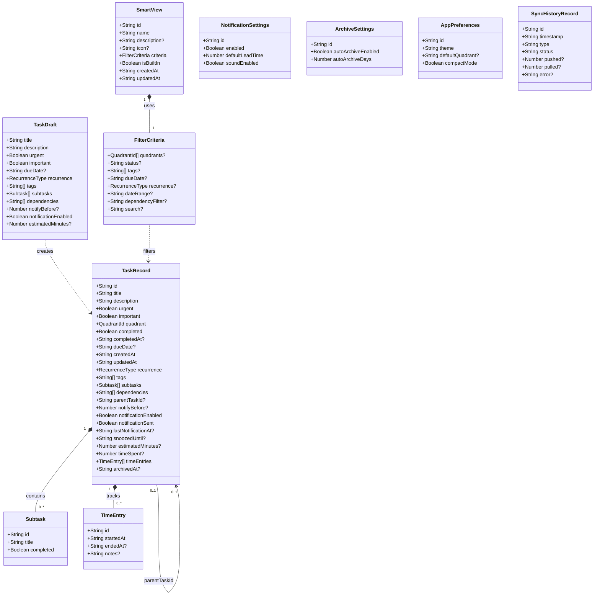

---

## 3. Class Diagram — Sync Layer

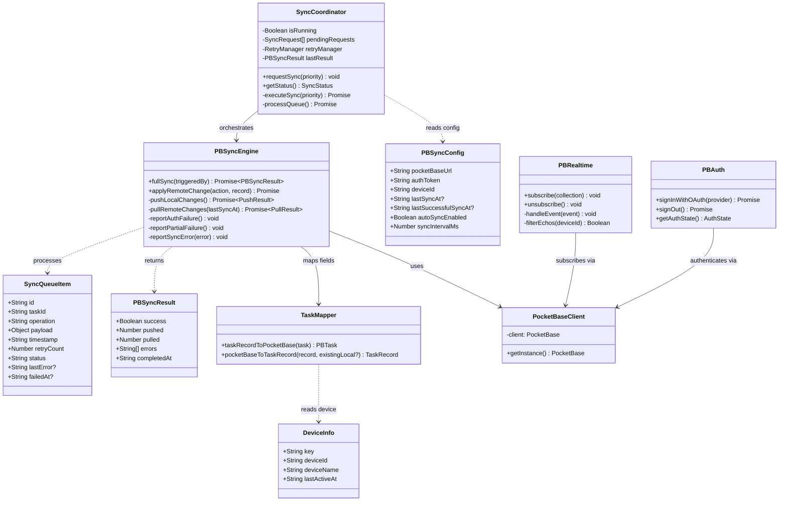

---

## 4. Class Diagram — Dependency Graph

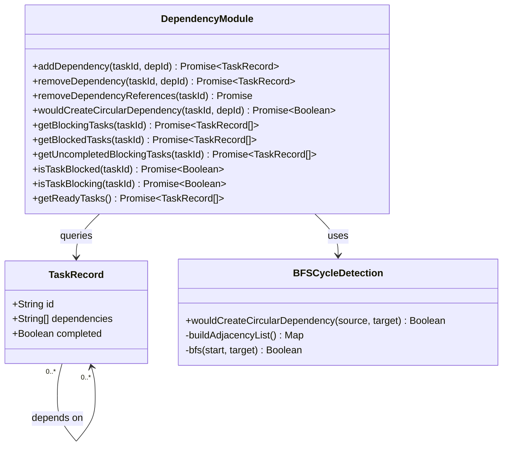

---

## 5. Sequence Diagram — Full Sync Flow

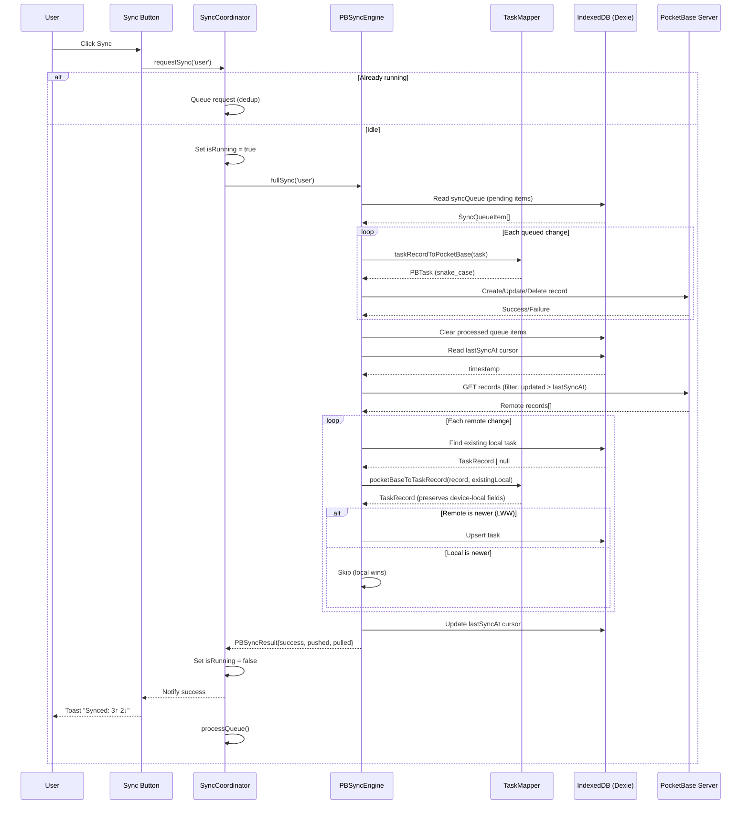

---

## 6. Sequence Diagram — Realtime Sync (SSE)

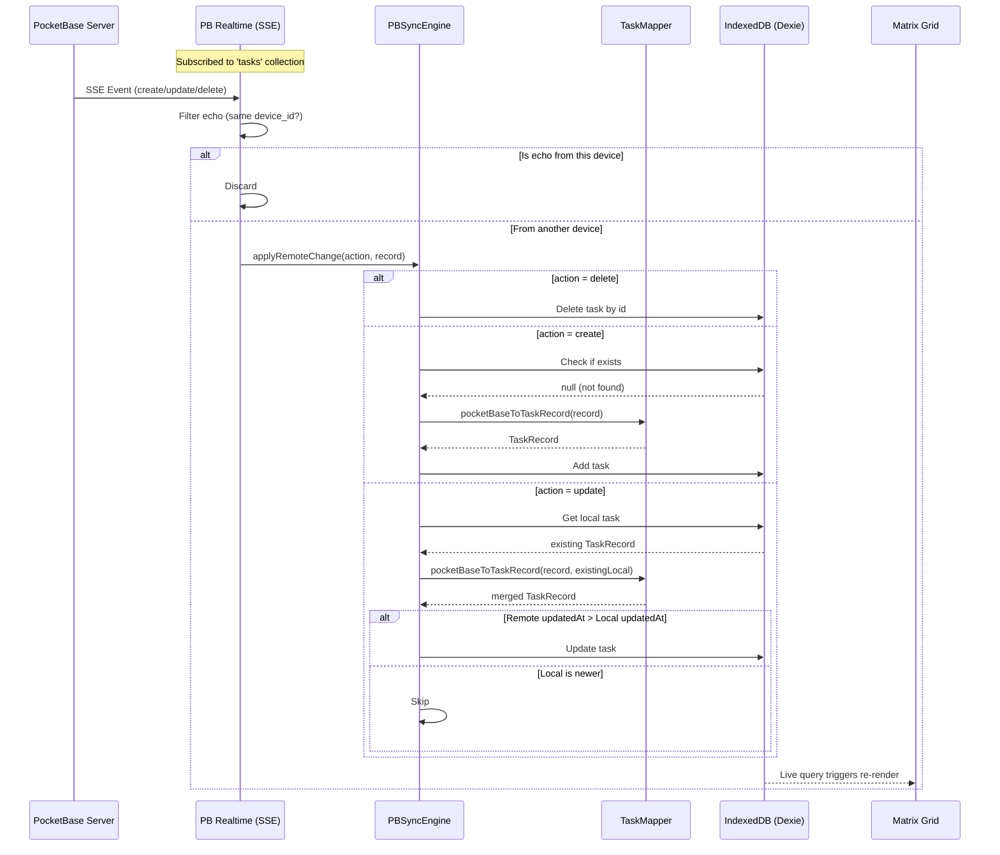

---

## 7. Sequence Diagram — Task Creation

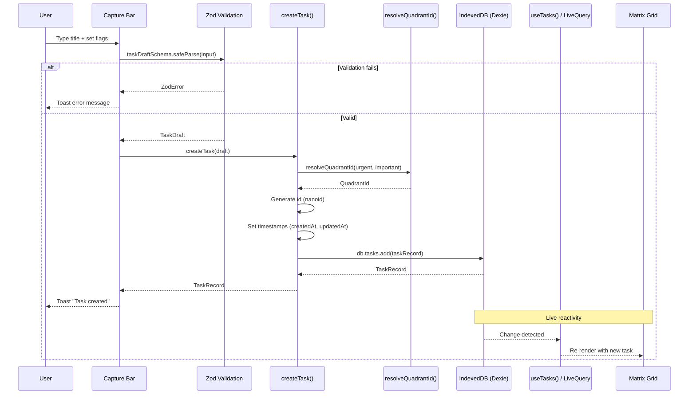

---

## 8. Sequence Diagram — Task Completion with Recurrence

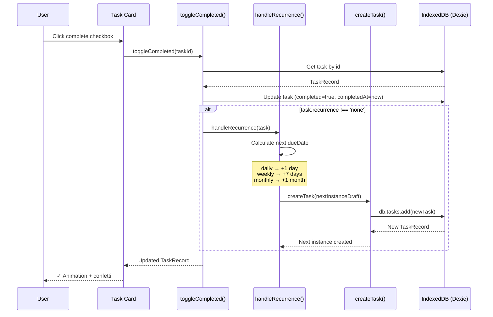

---

## 9. Component Diagram — MCP Server

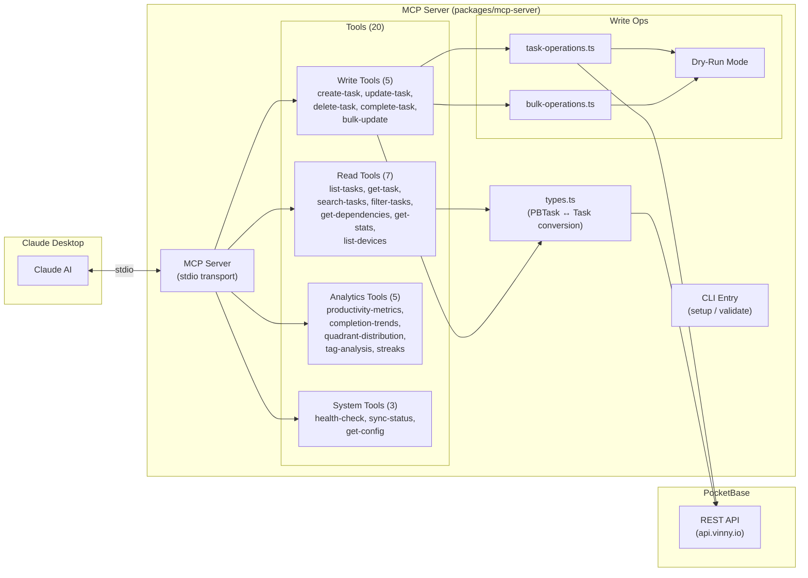

---

## 10. State Diagram — Sync Coordinator

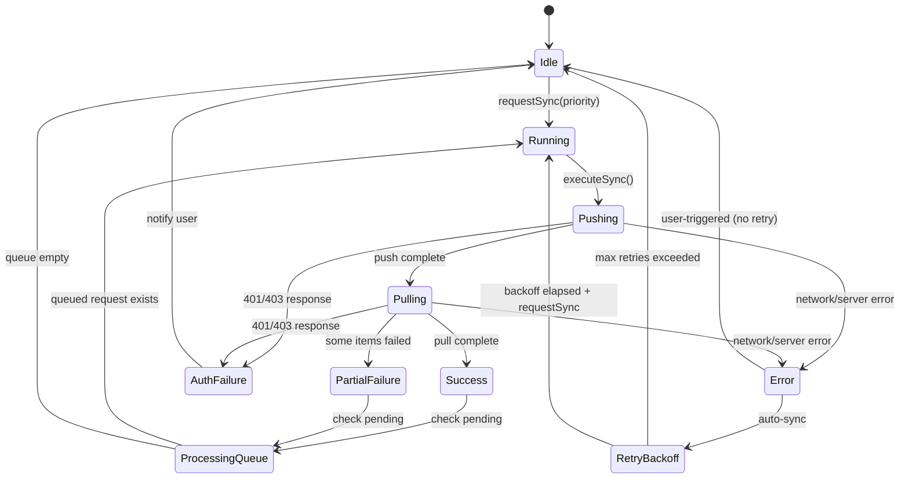

---

## 11. State Diagram — Task Lifecycle

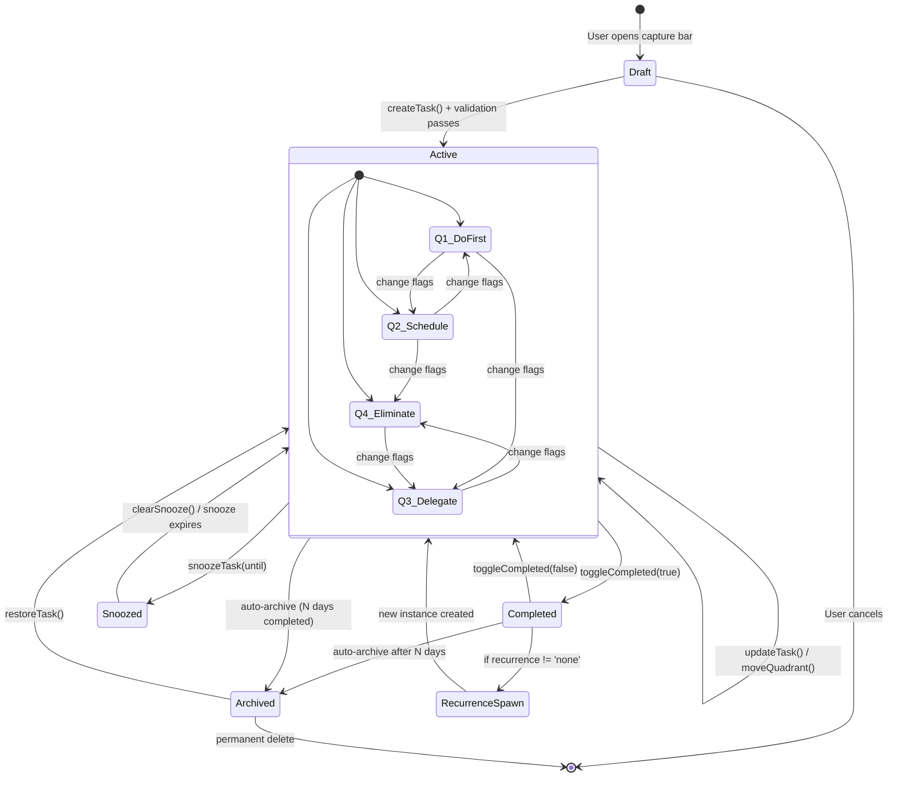

---

## Rendering

These diagrams render natively in:
- **GitHub** (README, Issues, PRs, Wiki)
- **VS Code** (with Mermaid extension)
- **Mermaid Live Editor**: [mermaid.live](https://mermaid.live)

To render locally: `npx @mermaid-js/mermaid-cli mmdc -i docs/uml-diagrams.md -o docs/uml-diagrams.svg`
